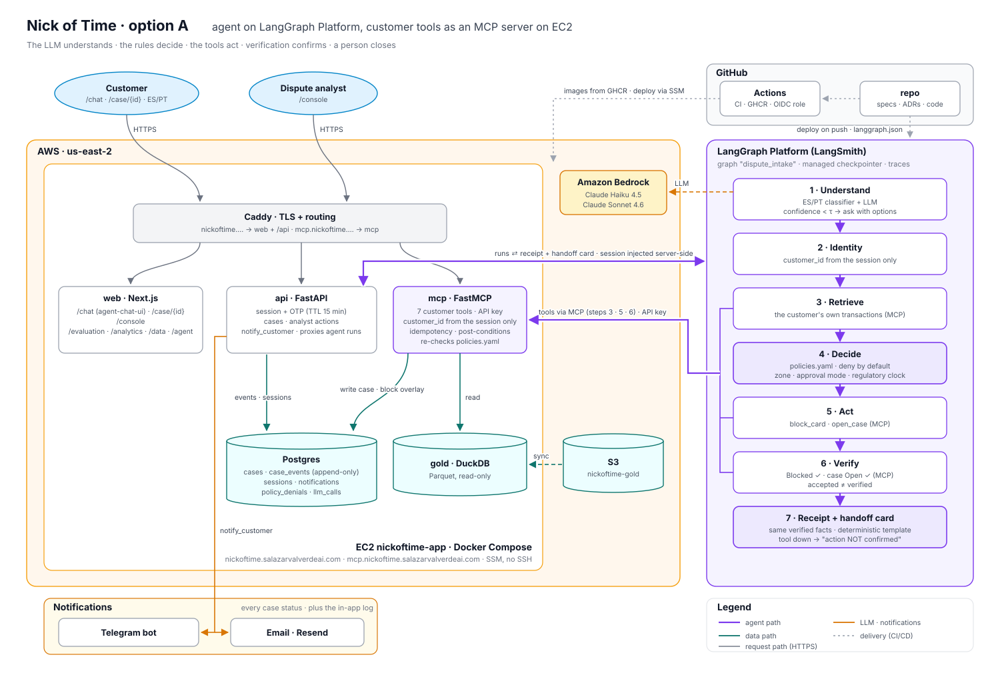

# factored-hackathon-2026-nick-of-time

Factored AI & Data Hackathon 2026, team Nick of Time. Synthetic LATAM Bank dataset (MX, CO, AR; Jun 2023 – Jun 2026).

Regulatory-clock **card dispute intake**: the customer reports an unrecognized or wrongful charge in Spanish or
Portuguese; the system identifies their own transaction, decides by rules, blocks the card and opens a case with
verification, computes the country's legal deadline, gives the customer a verified receipt and the analyst a handoff
card with evidence. A person always closes the case.



## Start here
| Document | What it is |
|---|---|
| [`CONTRIBUTING.md`](CONTRIBUTING.md) | How we work: spec workflow, EARS acceptance criteria, ADRs, branches, commits, approvals, releases |
| [`CLAUDE.md`](CLAUDE.md) | Durable context for AI coding agents: stack, constraints, business rules, layout and owners |
| [`STATUS.md`](STATUS.md) | What is deployed and verified, test results, what is missing |
| [`specs/`](specs/) | One spec per feature, with its owner, priority and status |
| [`docs/adr/`](docs/adr/) | Architecture Decision Records (18 so far) |
| [`docs/infrastructure.md`](docs/infrastructure.md) | AWS, domains, Platform and where each credential lives (no secrets) |
| [`CHANGELOG.md`](CHANGELOG.md) | Releases |
| [`problem.md`](problem.md) | The W3 problem definition and the numbers behind it |

## Contracts and data
| Path | Contents |
|---|---|
| [`contracts/policies.yaml`](contracts/policies.yaml) | Policy engine outside the model (`default: deny`): zones, approval modes, regulatory clock, queue, notifications, guardrails |
| [`contracts/tools.py`](contracts/tools.py) | Typed tool contracts (Pydantic); every tool resolves `customer_id` from the session |
| [`contracts/handoff.schema.json`](contracts/handoff.schema.json) | What the analyst receives: verified facts, actions, evidence, deadline |
| [`eval/eval_case.schema.json`](eval/eval_case.schema.json) | Held-out evaluation case; the harness compares final state, not text |
| [`contracts/gold_contract.md`](contracts/gold_contract.md) | Gold contract enforced by `data/pipeline/gold.py` (rules G1–G5) |
| [`data/pipeline/`](data/pipeline/) | Bronze → silver → gold pipeline on DuckDB with pandera contracts |
| [`data/quality_report.md`](data/quality_report.md) | Quality report generated by the pipeline |
| [`docs/eda/`](docs/eda/) · [`queries/`](queries/) | EDA records and the queries behind every pitch number |
| [`docs/assets/`](docs/assets/) | Architecture and flow diagrams |

## How to reproduce
```bash
aws configure --profile factored-dataset   # dataset keys (Factored data dictionary, p. 2); read-only
cp .env.example .env       # no secrets: profile names, region and buckets
make setup                 # venv + dependencies + pipeline from S3 + fixture + data/quality_report.md
make test                  # pytest, offline
make hooks                 # gitleaks pre-commit hook: blocks commits that contain secrets
```
`make setup SOURCE=local` runs on a local mirror already downloaded to `data/<table>/` (offline). Credentials live
only in `~/.aws/credentials` profiles (`factored-dataset` for the dataset, `nickoftime` for the team account); `.env`
holds no secrets and is not committed to git either. An older `.env` with `AWS_ACCESS_KEY_ID`/`S3_BUCKET` still works.
