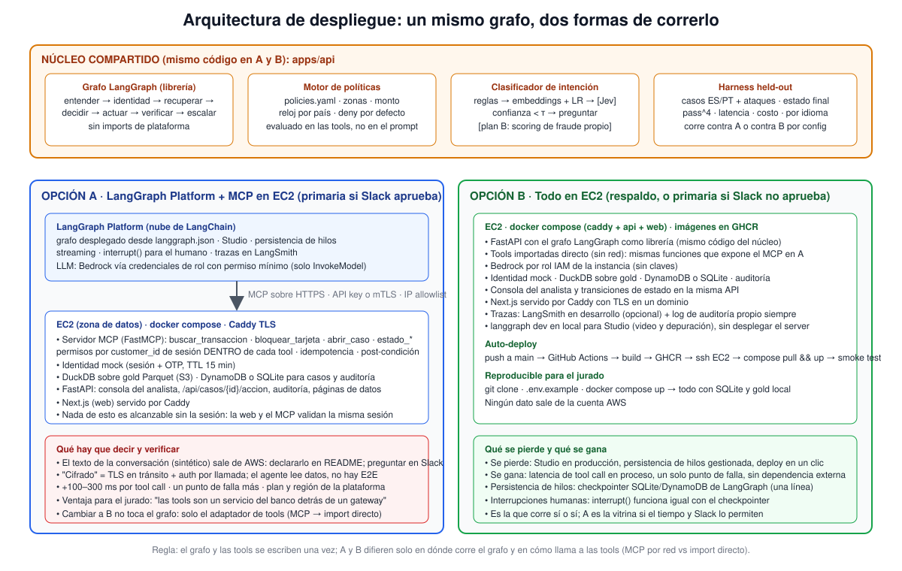

# Contra Reloj — guía de construcción (detalle para el equipo)

28 de septiembre de 2026 · Freddy

## Qué construimos

No es un chat: es una plataforma de atención de disputas con cuatro piezas sobre un mismo backend, y el chat es solo la puerta de entrada. El LLM entiende, las reglas deciden, las tools actúan, la verificación confirma y el humano recibe evidencia.

| Pieza | Qué es | Quién la usa | Criterio del reto |
| --- | --- | --- | --- |
| Canal del cliente | Chat ES/PT que hace el intake completo sin humano en zona alta y media | Cliente | Casos normal y ambiguo; idiomas |
| Núcleo de decisión y acción | Grafo LangGraph + clasificador de intención + motor de políticas (YAML) + tools tipadas + verificación + reloj regulatorio | Backend | Puntos 2 y 3: acciones verificadas, permisos fuera del modelo |
| Consola del analista | Bandeja de casos escalados con tarjeta de handoff, grafo de evidencia, traza y botones (aprobar abono, pedir datos, cerrar) | Analista de disputas | Caso "requiere humano"; escalation quality |
| Evidencia y evaluación | Log de auditoría, trazas, harness held-out, pipeline con contratos | Jurado y nosotros | Puntos 4, 5 y 6 |

Siete páginas en la web: `/` portada, `/chat` cliente, `/consola` analista, `/datos` pipeline y calidad, `/evaluacion` tabla de resultados, `/analytics` tablero, `/agente` grafo real y políticas. Las dos primeras van al video; las otras las abre el jurado después.

Fuera a propósito: investigación del caso, contracargo con la red, abono automático, voz, WhatsApp real, multi-agente, Graph RAG, fine-tuning. Resolvemos el contacto, no el reclamo: el reclamo lo resuelve el banco dentro del plazo que nosotros calculamos y mostramos.

| Alcance | Contenido |
| --- | --- |
| Entra (mínimo funcional) | Intake ES/PT; identidad mock con OTP; transacción del propio cliente; ticket automático en las tres zonas; triage por zona con bloqueo verificado; reloj regulatorio por país; tarjeta de handoff; consola del analista con sus tools; **modo de aprobación configurable** (auto, con aprobación humana o con verificación manual, activable por acción y con interruptor global); trazas y auditoría; harness held-out; deploy público; README reproducible |
| Entra si sobra tiempo | Grafo de evidencia por caso; Jev como tercer brazo del clasificador; `/analytics` embebido; voz en `/chat` con ElevenLabs |
| No entra | Investigación del caso, contracargo, abono automático, voz en tiempo real, WhatsApp real, multi-agente, Graph RAG, fine-tuning, modelo de fraude propio |

Dos actores, dos juegos de tools que nunca se cruzan: el cliente (a través del agente, vía MCP) puede buscar su transacción, obtener el score, calcular el plazo, bloquear su tarjeta y abrir su caso, siempre con verificación; el analista (desde la consola, vía API) lista y ve casos, aprueba abono o bloqueo, desbloquea, pide datos, marca ambiguo, cierra y reabre. El copiloto propone; solo el humano ejecuta las suyas.

## Conceptos que todos explican igual

Etiquetas de cada cifra: `[dato]` lo calculamos sobre el dataset del reto con query en el repo; `[externo]` fuente pública con link; `[supuesto]` estimación nuestra; `[simulado]` medido en nuestro harness, no en producción; `[proyectado]` extrapolación.

| Concepto | Definición que usamos | De dónde sale |
| --- | --- | --- |
| Disputa | Cargo no reconocido o cobro indebido sobre una transacción del cliente | `complaints.category` Transactions o Fees `[dato]` |
| Intake | Recibir el reclamo, verificar identidad, identificar la transacción exacta, decidir, actuar, verificar, abrir el caso con plazo y entregar al humano lo que él decide | Nuestro alcance |
| Resolución del contacto | El cliente termina con identidad verificada, transacción identificada, tarjeta protegida si había riesgo, número de caso, plazo y siguientes pasos, sin volver a llamar | Lo que mide el FCR (43.6% en quejas `[dato]`) y lo que reportamos como safe automated resolution |
| Resolución del reclamo | Abono y dictamen; la hace el banco en días dentro del plazo legal | Fuera de alcance; el sistema solo arranca el reloj |
| Zona | Franja del score que decide qué se automatiza: alta ≥ 50 (precisión 100%, recall 48.8% sobre fraudes con score, 38.7% del total), media 30–49 (precisión 79.6%), humano < 30 o sin score (20.6% de los fraudes) | `p08_fraud_score_umbrales.csv` `[dato]`; la precisión 100% es propiedad del generador sintético `[supuesto]` |
| Acción verificada | Después de actuar se relee el estado; solo se informa lo confirmado | Punto 2 del reto |
| Handoff | Tarjeta con solicitud, hechos verificados, acciones con resultado, evidencia (IDs), preguntas abiertas y plazo; nunca el chat crudo | Punto 3 del reto |
| Reloj regulatorio | Plazo legal por país y producto que corre desde el reclamo | CONDUSEF, BCRA, SFC, CMN 4.860 `[externo]` |
| Política fuera del modelo | Zonas, umbrales, permisos y plazos viven en `policies.yaml` y en las tools; el LLM no los lee ni los cambia | Punto 3 del reto |
| Held-out, baseline, pass^k | Casos que el sistema no vio; solución simple de comparación; cada caso k veces | Puntos 4 y 5 del reto |

Dos términos nuevos desde hoy: **modo de aprobación** es el ajuste por acción que decide si el sistema ejecuta solo (`auto`), propone y espera el clic del analista (`human_required`) o ejecuta y deja el caso en revisión (`manual_check`); **tools por actor** significa que el agente solo ve las del cliente y la consola solo las del analista, y cada llamada queda en auditoría con su actor.

## Arquitectura

El grafo y las tools se escriben una vez; A y B difieren solo en dónde corre el grafo y en cómo llama a las tools (MCP por red o import directo). GianMarco construye la EC2 primero porque es la base de ambas; Freddy levanta A encima cuando Platform tenga URL y Slack apruebe.

## Quién aporta qué en el proceso

Cada tarea tiene un "hecho cuando" observable. La franja de cada persona dice qué debe existir el viernes 2. Tacha aquí mismo lo que vayas cerrando.

Arriba, los seis pasos que recorre un caso; abajo, la pieza que cada uno aporta por detrás para que ese paso exista. El paso 4 es el único donde decide una regla, nunca el modelo.

| Persona | Entrega por detrás | Dónde entra en el flujo | Detalle |
| --- | --- | --- | --- |
| Freddy | Grafo en Platform, `policies.yaml` con modo de aprobación, servidor MCP con las tools del cliente, clasificador ES/PT, harness | Entender, decidir, actuar, verificar, escalar; la evaluación | Freddy |
| GianMarco | EC2 con auto-deploy, `/chat`, consola con las tools del analista por API, `case_events` y auditoría, páginas | Canal del cliente, consola del analista, registro de cada acción | GianMarco |
| David | Gold v1 y v2 con contratos, manifest, fixtures de demo y de llegadas tardías, `/datos` | Recuperar (lo que leen las tools) y la evidencia de data engineering | David |
| Diego | Queries del pitch, negocio y plazos, especificación de vistas, set de evaluación ES/PT, tablero | El problema en números, los casos que prueban el sistema, la tabla de resultados | Diego |

Stack, contratos, números verificados y pendientes: `05_anexos.md`. Detalle por persona: `01_freddy.md`, `02_gianmarco.md`, `03_david.md`, `04_diego.md`.

## Calendario e hitos

Ver `hitos` en el deck de plan (lun 28 contratos · mar 29 gold v1 y MCP · mié 30 EV-0001 end-to-end · jue 1 chat y 3 casos · vie 2 funcional · sáb 3 eval y deploy · dom 4 paquete · lun 5 entrega 5:00 pm).

El miércoles 30 ordena la semana: si EV-0001 no corre de punta a punta, el jueves se congela a los tres casos obligatorios y se recorta lo demás. La entrega es el lunes 5 de octubre a las 5:00 pm (hora por confirmar en Slack); se envía a primera hora para no depender de la tarde.

## Reglas de trabajo y dependencias externas

Cinco reglas y una definición de "funcional".

1. Contratos primero: nadie codea contra algo que no esté en `contracts/`; cambiar uno es un PR revisado por Freddy.
2. Un caso end-to-end por día en la URL pública desde el miércoles, aunque sea feo.
3. El harness es de todos: David agrega datos faltantes y tardíos; GianMarco sesión vencida y tool caída; Freddy inyección y ambigüedad ES/PT; Diego por país y segmento.
4. El jueves se congela el alcance. Lo de "si sobra tiempo" se toca el sábado.
5. Secretos: `.env` en `.gitignore` desde el primer commit; David revisa el historial el domingo.

Funcional el viernes significa: caso normal en español con bloqueo verificado, caso abierto y plazo MX visible; caso ambiguo en portugués que pregunta con opciones y no actúa; caso humano con tarjeta de handoff en la consola, copiloto que propone y humano que aprueba con registro en auditoría; el sistema dice no (inyección → DENY con `policy_id`, sesión vencida → reautenticar, tool caída → escala con acción no confirmada); modo supervisado activable desde la consola; traza visible por paso; `/datos` y `/analytics` con contenido real; deploy público que se levanta con `docker compose up`. Lista de recortes en orden: voz con ElevenLabs → grafo de evidencia → Jev → `/analytics` embebido → opción A si Platform falla. Los tres casos con verificación y handoff no se recortan nunca. Los datos son públicos y las claves del dataset también: no hay restricción para usar servicios externos, y se declara en el README.

| Dependencia | Si falla | Plan B | Dueño |
| --- | --- | --- | --- |
| Bedrock sin modelos el martes | No hay LLM | Orquestador con respuestas fijas hasta el miércoles; pedir habilitación hoy | Freddy |
| Databricks no lee el bucket | Pipeline atascado | DuckDB local sin discusión | David |
| Platform con plan o región que no sirve | Sin deploy del grafo | Opción B desde el miércoles: mismo grafo en FastAPI en la EC2 | Freddy y GianMarco |
| EC2 sin HTTPS a tiempo | El front no llama al backend | Caddy con dominio DuckDNS; mientras, todo local con compose | GianMarco |
| Jev no responde ES/PT | Sin tercer brazo | Se descarta el miércoles; LR queda como componente aprendido | Freddy |
| Freddy sobrecargado el miércoles | El grafo se atrasa | GianMarco toma el evaluador de políticas; Freddy se queda con grafo y harness | Todos |
