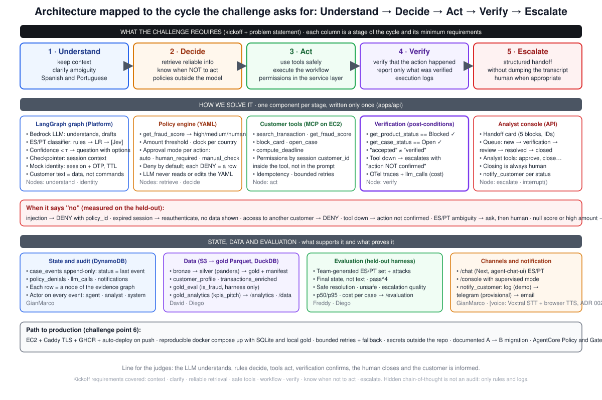
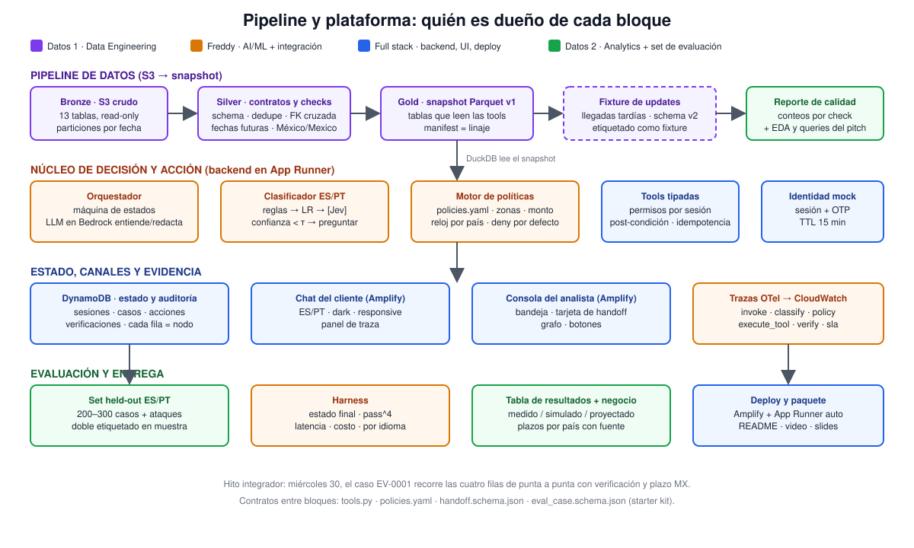

# Nick of Time — build guide (detail for the team)

September 28, 2026 · Freddy

## What we build

It is not a chat: it is a dispute-handling platform with four pieces on a single backend, and the chat is just the front door. The LLM understands, the rules decide, the tools act, verification confirms and the human receives evidence.

| Piece | What it is | Who uses it | Challenge criterion |
| --- | --- | --- | --- |
| Customer channel | ES/PT chat that does the complete intake with no human in the high and medium zones | Customer | Normal and ambiguous cases; languages |
| Decision and action core | LangGraph graph + intent classifier + policy engine (YAML) + typed tools + verification + regulatory clock | Backend | Points 2 and 3: verified actions, permissions outside the model |
| Analyst console | Inbox of escalated cases with handoff card, evidence graph, trace and buttons (approve credit, request info, close) | Dispute analyst | "Requires human" case; escalation quality |
| Evidence and evaluation | Audit log, traces, held-out harness, pipeline with contracts | Judges and us | Points 4, 5 and 6 |

Seven pages on the web: `/` landing page, `/chat` customer, `/console` analyst, `/data` pipeline and quality, `/evaluation` results table, `/analytics` dashboard, `/agent` real graph and policies. The first two go in the video; the judges open the others afterwards.

Out on purpose: case investigation, chargeback with the network, automatic credit, voice, real WhatsApp, multi-agent, Graph RAG, fine-tuning. We resolve the contact, not the complaint: the bank resolves the complaint within the deadline that we compute and show.

| Scope | Contents |
| --- | --- |
| In (functional minimum) | ES/PT intake; mock identity with OTP; the customer's own transaction; automatic ticket in all three zones; triage by zone with verified block; regulatory clock per country; **configurable approval mode** (auto, with human approval or with manual check; in the high zone the system acts right away and the case stays in verification); **closing always by a human**, automatic cases included; handoff card; analyst console with a five-status queue and its tools; **customer notification at every status** (log in the demo); **guardrails with IDs** at input, session, tools, policy, output and operations, each with its test case; traces and audit; sealed held-out harness; public deploy; reproducible README |
| In if time allows | Telegram notification (provisional); per-case evidence graph; Jev as a third arm; embedded `/analytics`; voice in `/chat` with ElevenLabs |
| Out | Case investigation, chargeback, automatic credit, real-time voice, real WhatsApp, multi-agent, Graph RAG, fine-tuning, our own fraud model |

Two actors, two sets of tools that never cross: the customer (through the agent, via MCP) can search their transaction, get the score, compute the deadline, block their card and open their case, always with verification; the analyst (from the console, via API) lists and views cases, approves credit or block, unblocks, requests info, marks ambiguous, closes and reopens. The copilot proposes; only the human executes theirs.

## Concepts everyone explains the same way

Labels for every figure: `[data]` we compute it on the challenge dataset with a query in the repo; `[external]` public source with link; `[assumption]` our estimate; `[simulated]` measured in our harness, not in production; `[projected]` extrapolation.

| Concept | Definition we use | Where it comes from |
| --- | --- | --- |
| Dispute | Unrecognized charge or wrongful charge on one of the customer's transactions | `complaints.category` Transactions or Fees `[data]` |
| Intake | Receive the complaint, verify identity, identify the exact transaction, decide, act, verify, open the case with a deadline and hand the human what they decide on | Our scope |
| Contact resolution | The customer ends with verified identity, identified transaction, card protected if there was risk, case number, deadline and next steps, without calling back | What FCR measures (43.6% in complaints `[data]`) and what we report as safe automated resolution |
| Complaint resolution | Credit and ruling; the bank does it over days within the legal deadline | Out of scope; the system only starts the clock |
| Zone | Score band that decides what gets automated: high ≥ 50 (precision 100%, recall 48.8% on frauds with a score, 38.7% of the total), medium 30–49 (precision 79.6%), human < 30 or no score (20.6% of frauds) | `p08_fraud_score_thresholds.csv` `[data]`; the 100% precision is a property of the synthetic generator `[assumption]` |
| Verified action | After acting, the state is read back; only what is confirmed is reported | Point 2 of the challenge |
| Handoff | Card with request, verified facts, actions with result, evidence (IDs), open questions and deadline; never the raw chat | Point 3 of the challenge |
| Regulatory clock | Legal deadline per country and product that runs from the complaint | CONDUSEF, BCRA, SFC, CMN 4.860 `[external]` |
| Policy outside the model | Zones, thresholds, permissions and deadlines live in `policies.yaml` and in the tools; the LLM neither reads nor changes them | Point 3 of the challenge |
| Held-out, baseline, pass^k | Cases the system has not seen; simple solution for comparison; each case k times | Points 4 and 5 of the challenge |

Two new terms from today: **approval mode** is the per-action setting that decides whether the system executes on its own (`auto`), proposes and waits for the analyst's click (`human_required`) or executes and leaves the case in review (`manual_check`); **tools per actor** means the agent only sees the customer's tools and the console only the analyst's, and every call is recorded in the audit log with its actor.

## Architecture

Deployment options A and B: `assets/deployment_options_A_B.svg`. Analyst flow: `assets/analyst_flow.svg`.

The graph and the tools are written once; A and B differ only in where the graph runs and how it calls the tools (MCP over the network or direct import). GianMarco builds the EC2 first because it is the base of both; Freddy brings up A on top once Platform has a URL and Slack approves.

## Who contributes what in the process

Every task has an observable "done when". Each person's lane says what must exist by Friday 2. Tick off what you close right here.

On top, the six steps a case goes through; below, the piece each person contributes behind the scenes so that step exists. Step 4 is the only one where a rule decides, never the model.

| Person | Delivers behind the scenes | Where it enters the flow | Detail |
| --- | --- | --- | --- |
| Freddy | Graph on Platform, `policies.yaml` with approval mode, MCP server with the customer tools, ES/PT classifier, harness | Understand, decide, act, verify, escalate; the evaluation | Freddy |
| GianMarco | EC2 with auto-deploy, `/chat`, console with the analyst tools via API, `case_events` and audit, pages | Customer channel, analyst console, record of every action | GianMarco |
| David | Gold v1 and v2 with contracts, manifest, demo and late-arrivals fixtures, `/data` | Retrieve (what the tools read) and the data engineering evidence | David |
| Diego | Pitch queries, business and deadlines, view specification, ES/PT evaluation set, dashboard | The problem in numbers, the cases that test the system, the results table | Diego |

Repo: `factored-hackathon-2026-nick-of-time`. Per-person detail in `docs/team/`; stack, contracts, numbers and open items in `docs/appendix.md`; differentiators in `docs/differentiators.md`; contracts in `contracts/`; schemas in `eval/`.

## Guardrails, by layer

None lives only in the prompt: each one has a place in code, an ID that DENYs cite and a case in the harness. Full list with implementation in `contracts/policies.yaml` (`guardrails`).

| ID | Layer | What it protects | Case that tests it |
| --- | --- | --- | --- |
| G-IN-01 | Input | Direct and indirect prompt injection: customer text and tool outputs as delimited data; injection classifier → human zone | injection |
| G-IN-02 | Input | Data made up by the customer: amount, date and merchant only serve for searching; score, product and country come from gold | injection |
| G-IN-03 | Input | Language and ambiguity: ES/PT with threshold; low confidence → question, then human | ambiguous |
| G-IN-04 | Input | PII and out of scope: PAN/CVV/password are rejected; topics outside disputes → abstention | out_of_scope |
| G-SES-01 / 02 | Session | OTP with TTL; `customer_id` only from the session; access to another customer → DENY | session_expired, unauthorized_access |
| G-TOOL-01 / 02 | Tools | Allowlist and strict schemas; writes with approval mode, idempotency and post-condition; credit never auto | unauthorized_access, tool_failure |
| G-POL-01 | Policy | Deny by default; every denial is a row in `policy_denials` | all |
| G-OUT-01 / 02 | Output | Grounding: every number, date, ID or status exists in a tool or in the policy; "blocked" only with verified status | missing_data, tool_failure |
| G-OUT-03 / 04 | Output | No other customers' data or secrets in the response; no promises the policy did not give; explicit abstention | unauthorized_access, missing_data |
| G-OPS-01 / 02 | Operations | Token cap before calling, bounded retries, timeout; immutable audit with actor and `trace_id` | cap, inspection |

## Test data: what comes from the dataset and what we add

The dataset gives the ground truth of the state (customers, products, transactions, scores, country) and the fraud labels; it does not give conversations or dispute outcomes tied to a transaction. The partition is done once, in gold: `split` by customer (`hash(customer_id) mod 10`: 0–6 training, 7 development, 8–9 held-out) and `period` by time (fit Jun-2025 to Feb-2026, measurement Mar–May-2026).

| Set | Where it comes from | What for | Split and seal |
| --- | --- | --- | --- |
| ML test on `is_fraud` | 100% dataset (`gold_eval`) | Score zones and, if needed, the fallback scoring | Fit with customers 0–6 × fit period; measurement on 8–9 × measurement period |
| Agent held-out (~180 cases) | Real state of customers 8–9 + a message written by us; the expected outcome is derived from the record | Safe resolution, unsafe outcomes, escalation quality, latency, cost, pass^4; agent blocks against real `is_fraud` | Sealed on Thursday 1 (`eval/heldout.sha256`); run 4 times on Saturday; nothing is tuned afterwards |
| Development cases (~60) | Customers from partition 7 | Build and debug | No seal |
| Text classifier set (300–400 sentences) | Team-generated ES/PT with intent and slots | Learned component vs baselines | 70/15/15 by author or template; nothing from the test appears in the held-out or in the prompt |

## Differentiators versus other teams

With ~180 teams and 10 days, most will converge on a chat with RAG over made-up policies, almost always W1, with the LLM deciding, containment metrics on a demo and no held-out. What sets us apart, each item tied to a challenge criterion and with a proof we show:

| Differentiator | Challenge criterion | How it is shown |
| --- | --- | --- |
| Visible verification: accepted ≠ verified; tool down → unconfirmed action | Point 2 | `tool_failure` case in the video |
| Policy outside the model, with every DENY as a row and guardrails with IDs | Points 3 and 5 | The injection fools the text, not the rule |
| Configurable approval mode and closing always by a human | "AI should not be autonomous just because it can" | Supervised switch in the console |
| Evaluation by final state, pass^4, n per cell, ES/PT and attacks, on a sealed held-out | Points 4 and 5 | Table with failures included |
| Agent blocks measured against the dataset's real `is_fraud` | Unsafe outcomes | A metric we did not write |
| The 15 numbers reproducible with `make setup` in 60 s and corrected in public | Point 1, Data Analytics | Number → query → CSV index in `docs/eda/README.md` |
| Regulatory clock per country with source | Business reasoning | Business day 2 visible in the case |
| Two actors with separate tools and customer notification at every status | Escalation quality | Console + customer panel |
| Data / external / assumption / simulated / projected labels everywhere | The honesty the kickoff asks for | Every number in the pitch and the README |

Where we could lose: if the end-to-end case does not run by Wednesday 30; if the ES/PT classifier ends up weak and the learned component looks like decoration (the rules baseline comes before the model); and if the demo looks poor next to pretty interfaces (`/chat` starts from `agent-chat-ui`).

## Calendar and milestones

See the milestones (`hitos`) in the plan deck (Mon 28 contracts · Tue 29 gold v1 and MCP · Wed 30 EV-0001 end-to-end · Thu 1 chat and 3 cases · Fri 2 functional · Sat 3 eval and deploy · Sun 4 package · Mon 5 submission 5:00 pm).

Wednesday 30 sets the order of the week: if EV-0001 does not run end to end, on Thursday scope is frozen to the three mandatory cases and everything else is cut. The submission is Monday, October 5 at 5:00 pm (time to be confirmed on Slack); we send it first thing in the morning so as not to depend on the afternoon.

## Working rules and external dependencies

Five rules and a definition of "functional".

1. Contracts first: nobody codes against anything that is not in `contracts/`; changing one is a PR reviewed by Freddy.
2. One end-to-end case per day on the public URL from Wednesday on, even if it is ugly.
3. The harness belongs to everyone: David adds missing and late data; GianMarco expired session and tool down; Freddy injection and ES/PT ambiguity; Diego by country and segment.
4. Scope is frozen on Thursday. The "if time allows" items are touched on Saturday.
5. Secrets: `.env` in `.gitignore` from the first commit; David reviews the history on Sunday.

Functional on Friday means: normal case in Spanish with verified block, case opened and MX deadline visible; ambiguous case in Portuguese that asks with options and does not act; human case with handoff card in the console, copilot that proposes and human who approves, recorded in the audit log; the system says no (injection → DENY with `policy_id`, expired session → reauthenticate, tool down → escalates with unconfirmed action); supervised mode can be switched on from the console; trace visible per step; `/data` and `/analytics` with real content; public deploy that comes up with `docker compose up`. Cut list in order: voice with ElevenLabs → evidence graph → Jev → embedded `/analytics` → option A if Platform fails. The three cases with verification and handoff are never cut. The data is public and so are the dataset keys: there is no restriction on using external services, and it is declared in the README.

| Dependency | If it fails | Plan B | Owner |
| --- | --- | --- | --- |
| Bedrock without models on Tuesday | No LLM | Orchestrator with fixed responses until Wednesday; request enablement today | Freddy |
| Databricks cannot read the bucket | Pipeline stuck | Local DuckDB, no discussion | David |
| Platform with a plan or region that does not work | No graph deploy | Option B from Wednesday: same graph in FastAPI on the EC2 | Freddy and GianMarco |
| EC2 without HTTPS in time | The front end cannot call the backend | Caddy with a DuckDNS domain; meanwhile, everything local with compose | GianMarco |
| Jev does not handle ES/PT | No third arm | Dropped on Wednesday; LR stays as the learned component | Freddy |
| Freddy overloaded on Wednesday | The graph falls behind | GianMarco takes the policy evaluator; Freddy keeps the graph and harness | Everyone |
