# Decisions graph

<!-- Generated by scripts/docs/decision_graph.py from the ADR and spec headers and docs/decisions/graph_extra.yaml. Do not edit by hand: run `python scripts/docs/decision_graph.py`. `--check` fails when this file is stale. -->

One picture of the project's reasoning: the problem the data showed, the decisions that answered it, the specs and components that implement them, and the evidence behind each. Every ADR and spec is a node; every edge comes from a header (`Status`, `Amended by`, `Related`, `ADRs`, `Depends on`) or from the small mapping in [`graph_extra.yaml`](graph_extra.yaml). The same graph, with every edge, is in [`graph.json`](graph.json).

**Size:** 4 problem nodes, 30 decision nodes (31 ADRs, ADRs 0001 and 0002 drawn as one), 18 specs, 15 evidence nodes: 67 nodes and 85 edges drawn.

```mermaid
flowchart LR
  subgraph LP["1. Problem [data]"]
    P1["P1 [data] W3 = 36.4% of complaints (24,431 of 67,095)<br/>queries/pitch/p01_w3_share_complaints.sql"]
    P2["P2 [data] FCR 43.6% on complaint contacts vs 76.6% for the bank<br/>queries/pitch/p02_fcr_complaint_vs_bank.sql"]
    P3["P3 [data] Follow-up needed in 63.0% of complaint contacts vs 34.8% for the bank<br/>queries/pitch/p03_complaint_follow_up.sql"]
    P4["P4 [data] fraud_score >= 50: precision 100%, recall of all frauds 38.7%<br/>queries/pitch/p08_fraud_score_thresholds.sql"]
  end
  subgraph LD["2. Decisions (ADRs)"]
    subgraph TScope_and_process["Scope and process"]
      collapsed_process["0001 and 0002: ADRs plus spec-driven work, English repository"]
      adr_0003["0003 Scope: regulatory-clock card dispute intake..."]
      adr_0014["0014 Main objective: first-contact resolution of..."]
    end
    subgraph TData_and_evaluation["Data and evaluation"]
      adr_0004["0004 Medallion pipeline on DuckDB with data..."]
      adr_0007["0007 Evaluation by final state on a sealed..."]
      adr_0015["0015 Learned components versus baselines, with a..."]
      adr_0018["0018 Data and model lifecycle: an operational..."]
      adr_0021["0021 Continuous evaluation and outcome audit: a..."]
      adr_0022["0022 Fraud labels may train our fraud model, by..."]
      adr_0025["0025 The classifier set is written by three..."]
      adr_0028["0028 The classifier test split is decided by..."]
    end
    subgraph TAgent__rules_and_safety["Agent, rules and safety"]
      adr_0005["0005 Policy engine outside the model"]
      adr_0006["0006 The bank's fraud score as an optional,..."]
      adr_0008["0008 Agent on LangGraph Platform, customer tools..."]
      adr_0009["0009 LLM on Amazon Bedrock: Claude Sonnet 4.6..."]
      adr_0013["0013 The customer receives proof: verified..."]
      adr_0016["0016 Guardrails: injection detector with rules +..."]
      adr_0024["0024 A call request in the high zone defers the..."]
      adr_0027["0027 Model selection per LLM task (understand,..."]
    end
    subgraph TPlatform_and_identity["Platform and identity"]
      adr_0010["0010 Postgres for case state and audit"]
      adr_0011["0011 One EC2 with Docker Compose, two..."]
      adr_0017["0017 Identity: mock session + OTP for customers,..."]
      adr_0026["0026 Public demo sessions: a scenario picks the..."]
      adr_0029["0029 Voice: Bedrock Voxtral speech-to-text on..."]
    end
    subgraph TTime_and_regulation["Time and regulation"]
      adr_0012["0012 Frozen demo date"]
      adr_0019["0019 Every regulatory or external figure cites..."]
      adr_0020["0020 Two time modes: historical (replay) for..."]
      adr_0023["0023 MX provisional credit covers..."]
    end
    subgraph TOther["Other"]
      adr_0030["0030 An LLM writer words chat replies, and the..."]
      adr_0031["0031 Held-out scored under the sealed rules and,..."]
    end
  end
  subgraph LS["3. Specs and components"]
    spec_01["01 Integration contract + stubs<br/>Draft | contracts/"]
    spec_02["02 Policy engine + regulatory clock<br/>In progress | packages/nick_of_time/policy/"]
    spec_03["03 MCP server with the 16 customer...<br/>Draft | apps/mcp/mcp_server/"]
    spec_04["04 Agent graph on LangGraph Platform<br/>Draft | apps/agent/agent/"]
    spec_05["05 Backend: API + Postgres + analyst...<br/>In progress | apps/api/app/"]
    spec_06["06 Deploy + CI<br/>Draft | infra/"]
    spec_07["07 Customer chat /chat with verified...<br/>In progress | apps/web/app/chat/"]
    spec_08["08 Analyst login + console /login,...<br/>In progress | apps/web/app/console/"]
    spec_09["09 Demo and evaluation data<br/>Implemented | eval/demo/"]
    spec_10["10 Evaluation harness<br/>Implemented | eval/harness/"]
    spec_11["11 Intent classifier, injection...<br/>Draft | packages/nick_of_time/nlu/"]
    spec_12["12 Insight pages: /evaluation,...<br/>Implemented | apps/web/app/evaluation/"]
    spec_13["13 /case/{id} + Telegram + email...<br/>In progress | apps/web/app/case/"]
    spec_14["14 Operational lakehouse<br/>In progress | data/pipeline/"]
    spec_15["15 Model benchmark (cost vs quality,...<br/>Draft | eval/bench/"]
    spec_16["16 Web foundation + front-end standard<br/>Implemented | apps/web/README.md"]
    spec_17["17 Our fraud model versus the bank's...<br/>Draft | scripts/ml/"]
    spec_18["18 Outcome auditor and AI second...<br/>Draft | packages/nick_of_time/audit/"]
  end
  subgraph LE["4. Evidence"]
    E_audit["tests/test_spec18_audit_a3_a7.py"]
    E_bench["eval/bench/gate_evidence.yaml"]
    E_decide["tests/test_spec02_decide.py"]
    E_demo["PR 188: demo sessions in replay mode"]
    E_deploy[".github/workflows/deploy.yml"]
    E_fcr_panel["PR 171: as-is vs with Nick of Time panel"]
    E_fraud["tests/test_spec17_screen.py"]
    E_gold["tests/test_spec14_gold.py"]
    E_identity["tests/test_spec05_guard.py"]
    E_mcp["tests/test_spec03_server.py"]
    E_notify["PR 174: notify only after the verifying read"]
    E_policies["contracts/policies.yaml (default: deny)"]
    E_protocol["eval/PROTOCOL.md (sealed protocol)"]
    E_respond["tests/test_spec04_respond.py"]
    E_store["tests/test_spec01_store.py"]
  end
  adr_0023 -. amends .-> adr_0019
  adr_0023 -. amends .-> adr_0020
  adr_0028 -. amends .-> adr_0025
  adr_0004 --> E_gold
  adr_0005 --> E_decide
  adr_0005 --> E_policies
  adr_0006 --> E_policies
  adr_0007 --> E_protocol
  adr_0008 --> E_mcp
  adr_0009 --> E_bench
  adr_0010 --> E_store
  adr_0011 --> E_deploy
  adr_0013 --> E_notify
  adr_0013 --> E_respond
  adr_0014 --> E_fcr_panel
  adr_0015 --> E_bench
  adr_0015 --> E_protocol
  adr_0016 --> E_respond
  adr_0017 --> E_identity
  adr_0018 --> E_gold
  adr_0019 --> E_policies
  adr_0020 --> E_demo
  adr_0021 --> E_audit
  adr_0022 --> E_fraud
  adr_0023 --> E_policies
  adr_0024 --> E_decide
  adr_0025 --> E_protocol
  adr_0026 --> E_demo
  adr_0027 --> E_bench
  adr_0028 --> E_protocol
  adr_0006 --> spec_02
  adr_0008 --> spec_01
  adr_0008 --> spec_03
  adr_0008 --> spec_04
  adr_0009 --> spec_04
  adr_0009 --> spec_15
  adr_0010 --> spec_01
  adr_0010 --> spec_05
  adr_0010 --> spec_14
  adr_0011 --> spec_06
  adr_0013 --> spec_04
  adr_0013 --> spec_07
  adr_0013 --> spec_13
  adr_0015 --> spec_09
  adr_0015 --> spec_10
  adr_0015 --> spec_11
  adr_0015 --> spec_15
  adr_0016 --> spec_04
  adr_0016 --> spec_11
  adr_0017 --> spec_05
  adr_0017 --> spec_08
  adr_0018 --> spec_14
  adr_0019 --> spec_02
  adr_0020 --> spec_01
  adr_0020 --> spec_02
  adr_0020 --> spec_03
  adr_0020 --> spec_04
  adr_0020 --> spec_05
  adr_0020 --> spec_09
  adr_0020 --> spec_10
  adr_0020 --> spec_11
  adr_0020 --> spec_15
  adr_0021 --> spec_10
  adr_0021 --> spec_17
  adr_0021 --> spec_18
  adr_0022 --> spec_17
  adr_0023 --> spec_02
  adr_0024 --> spec_02
  adr_0025 --> spec_09
  adr_0026 --> spec_05
  adr_0029 --> spec_05
  adr_0029 --> spec_07
  adr_0031 --> spec_10
  P1 --> adr_0003
  P1 --> adr_0004
  P2 --> adr_0013
  P2 --> adr_0014
  P2 --> adr_0015
  P3 --> adr_0007
  P3 --> adr_0013
  P4 --> adr_0005
  P4 --> adr_0006
  P4 --> adr_0016
  P4 --> adr_0022
  adr_0020 == supersedes ==> adr_0012
  classDef problem fill:#FEF3C7,stroke:#D97706,color:#1F2937
  classDef decision fill:#EDE9FE,stroke:#7C3AED,color:#1F2937
  classDef spec fill:#F1F5F9,stroke:#94A3B8,color:#1F2937
  classDef evidence fill:#CCFBF1,stroke:#0F766E,color:#1F2937
  class P1,P2,P3,P4 problem
  class adr_0003,adr_0004,adr_0005,adr_0006,adr_0007,adr_0008,adr_0009,adr_0010,adr_0011,adr_0012,adr_0013,adr_0014,adr_0015,adr_0016,adr_0017,adr_0018,adr_0019,adr_0020,adr_0021,adr_0022,adr_0023,adr_0024,adr_0025,adr_0026,adr_0027,adr_0028,adr_0029,adr_0030,adr_0031,collapsed_process decision
  class spec_01,spec_02,spec_03,spec_04,spec_05,spec_06,spec_07,spec_08,spec_09,spec_10,spec_11,spec_12,spec_13,spec_14,spec_15,spec_16,spec_17,spec_18 spec
  class E_audit,E_bench,E_decide,E_demo,E_deploy,E_fcr_panel,E_fraud,E_gold,E_identity,E_mcp,E_notify,E_policies,E_protocol,E_respond,E_store evidence
```

## Legend

| Shape or line | Meaning |
|---|---|
| Amber box | A finding from the data. Every figure carries its label and the query that produced it (`[data]`, constitution rule 8). |
| Violet box | An ADR (decision). Boxes are grouped by theme only for layout. |
| Grey box | A spec, with its status and its main component. |
| Teal box | Evidence: a test, a committed result file, a metric file or a merged PR. |
| `-->` | A problem motivates a decision; a decision is implemented by a spec (drawn when the ADR's `Related` and the spec's `ADRs` agree); a decision is backed by evidence. |
| `-. amends .->` | The ADR amends an earlier ADR (from the target's `Amended by` header). |
| `== supersedes ==>` | The ADR replaces an earlier one (from `Status`). |

Not drawn, to keep the picture readable, but present in `graph.json`: `Related` links between ADRs (`kind: related`), spec dependencies (`kind: depends_on`, also in the specs table) and ADR-side `Related` links to specs that the spec's own `ADRs` header does not repeat, or the reverse (`kind: implemented_by`, `source: adr-header` or `spec-header`; the drawn edges are `both-headers`), and evidence for specs.

## The problem, with its numbers

| Id | Finding | Label | Query | Decisions it drove |
|---|---|---|---|---|
| P1 | W3 = 36.4% of complaints (24,431 of 67,095) | `[data]` | [`p01_w3_share_complaints.sql`](../../queries/pitch/p01_w3_share_complaints.sql) (output [`p01_w3_share_complaints.csv`](../../queries/pitch/p01_w3_share_complaints.csv)) | [0003](../adr/0003-scope-regulatory-clock-dispute-intake.md), [0004](../adr/0004-medallion-pipeline-on-duckdb.md) |
| P2 | FCR 43.6% on complaint contacts vs 76.6% for the bank | `[data]` | [`p02_fcr_complaint_vs_bank.sql`](../../queries/pitch/p02_fcr_complaint_vs_bank.sql) (output [`p02_fcr_complaint_vs_bank.csv`](../../queries/pitch/p02_fcr_complaint_vs_bank.csv)) | [0014](../adr/0014-main-objective-fcr.md), [0013](../adr/0013-customer-receives-proof-receipt-case-page-notifications.md), [0015](../adr/0015-learned-component-vs-baseline-and-model-selection.md) |
| P3 | Follow-up needed in 63.0% of complaint contacts vs 34.8% for the bank | `[data]` | [`p03_complaint_follow_up.sql`](../../queries/pitch/p03_complaint_follow_up.sql) (output [`p03_complaint_follow_up.csv`](../../queries/pitch/p03_complaint_follow_up.csv)) | [0013](../adr/0013-customer-receives-proof-receipt-case-page-notifications.md), [0007](../adr/0007-evaluation-by-final-state-on-sealed-held-out.md) |
| P4 | fraud_score >= 50: precision 100%, recall of all frauds 38.7% | `[data]` | [`p08_fraud_score_thresholds.sql`](../../queries/pitch/p08_fraud_score_thresholds.sql) (output [`p08_fraud_score_thresholds.csv`](../../queries/pitch/p08_fraud_score_thresholds.csv)) | [0005](../adr/0005-policy-engine-outside-the-model.md), [0006](../adr/0006-fraud-score-as-optional-swappable-input.md), [0016](../adr/0016-guardrails-injection-detector-and-exact-grounding.md), [0022](../adr/0022-fraud-labels-for-model-training.md) |

The dataset is synthetic; these figures describe the problem, not our system (see [`problem_in_numbers.md`](../problem_in_numbers.md)).

## Decision, why, evidence

| ADR | Decision | Why | Specs | Evidence |
|---|---|---|---|---|
| [0001 Record decisions as ADRs and build features from specs](../adr/0001-record-decisions-and-work-spec-driven.md) · Accepted | Adopt spec-driven development for every new feature (one spec per feature in specs/, EARS acceptance criteria, a test per criterion) and record every load-bearing decision as an ADR in docs/adr/, one file per decision. | Three senior engineers build in parallel with AI assistants under a fixed deadline (2026-10-05). | - | - |
| [0002 English as the repository language](../adr/0002-english-as-the-repository-language.md) · Accepted | In the context of a public repository judged by an international panel, we write everything recorded in the repo in English — code, identifiers, contracts, docs, specs, ADRs, commits, pull requests, issues and the UI the judges ... | The team works in Spanish, the bank's customers write in Spanish and Portuguese, and the judges and the wider engineering audience read English. | - | - |
| [0003 Scope: regulatory-clock card dispute intake (W3)](../adr/0003-scope-regulatory-clock-dispute-intake.md) · Accepted | Build the intake of card disputes end to end: understand the customer (ES/PT), identify their own transaction, decide by rules, act with verification (block the card, open the case), compute the country's regulatory deadline, ... | **P1**: The EDA mapped complaints to four workflows. | - | - |
| [0004 Medallion pipeline on DuckDB with data contracts](../adr/0004-medallion-pipeline-on-duckdb.md) · Accepted | Bronze → silver → gold in Python with DuckDB and Polars. | **P1**: The dataset arrives as partitioned CSVs on S3 with duplicates, late arrivals, mixed labels (México/Mexico), broken foreign keys and a fraud label that must never reach the agent. | [14](../../specs/14-ops-lakehouse.md) | [`test_spec14_gold.py`](../../tests/test_spec14_gold.py) |
| [0005 Policy engine outside the model](../adr/0005-policy-engine-outside-the-model.md) · Accepted | The LLM understands, the rules decide, the tools act, verification confirms, a person closes. | **P4**: The challenge asks where AI is appropriate and where deterministic logic is preferable. | [01](../../specs/01-integration-contract.md), [02](../../specs/02-policy-engine.md), [03](../../specs/03-mcp-tools.md), [04](../../specs/04-agent-graph.md) | [`test_spec02_decide.py`](../../tests/test_spec02_decide.py), [`policies.yaml`](../../contracts/policies.yaml) |
| [0006 The bank's fraud score as an optional, swappable input](../adr/0006-fraud-score-as-optional-swappable-input.md) · Accepted | Consume the score through a get_fraud_score tool with a configurable provider (dataset now; rules, model, llm later); source and version go to the audit log and the handoff card. | **P4**: The dataset carries the bank's fraud_score (0–100, null for 20.6% of frauds). | [02](../../specs/02-policy-engine.md), [03](../../specs/03-mcp-tools.md), [17](../../specs/17-fraud-model.md) | [`policies.yaml`](../../contracts/policies.yaml) |
| [0007 Evaluation by final state on a sealed held-out](../adr/0007-evaluation-by-final-state-on-sealed-held-out.md) · Accepted | The harness compares the final state — product status, case opened, handoff emitted, queue status, notifications, guardrails fired, data exposed, receipt with a date — not the reply text. | **P3**: The dataset has no real customer text. | [01](../../specs/01-integration-contract.md), [09](../../specs/09-demo-eval-data.md), [10](../../specs/10-eval-harness.md), [12](../../specs/12-insight-pages.md), [17](../../specs/17-fraud-model.md), [18](../../specs/18-outcome-auditor.md) | [`PROTOCOL.md`](../../eval/PROTOCOL.md) |
| [0008 Agent on LangGraph Platform, customer tools as an MCP server](../adr/0008-agent-on-langgraph-platform-tools-over-mcp.md) · Accepted | The LangGraph graph (dispute_intake: understand → identity → retrieve → decide → act → verify → receipt + handoff) runs on LangGraph Platform, deployed from GitHub with langgraph.json, with a managed checkpointer and traces. | The agent needs a typed state, human-in-the-loop interrupts, a checkpointer, traces and a deployment that does not compete with the web stack for time. | [01](../../specs/01-integration-contract.md), [03](../../specs/03-mcp-tools.md), [04](../../specs/04-agent-graph.md) | [`test_spec03_server.py`](../../tests/test_spec03_server.py) |
| [0009 LLM on Amazon Bedrock: Claude Sonnet 4.6 and Haiku 4.5](../adr/0009-llm-on-amazon-bedrock.md) · Accepted | Use Bedrock as the LLM provider: Claude Sonnet 4.6 as the candidate for the graph and Claude Haiku 4.5 for cheap, structured tasks (intent and slot extraction). | Bedrock in us-east-2 offers Claude Sonnet 4.6, Sonnet 4.5 and Haiku 4.5 to this account; the Claude 5 family has a quota of 0 (raising it requires AWS sales). | [04](../../specs/04-agent-graph.md), [11](../../specs/11-intent-classifier.md), [15](../../specs/15-model-benchmark.md) | [`gate_evidence.yaml`](../../eval/bench/gate_evidence.yaml) |
| [0010 Postgres for case state and audit](../adr/0010-postgres-for-case-state-and-audit.md) · Accepted | Postgres, as a container in the EC2 Docker Compose with a persistent volume and a daily pg_dump to the project's S3 bucket. | State is small but must be auditable: cases, case events, sessions, notifications, policy denials, LLM calls and the product-status overlay. | [01](../../specs/01-integration-contract.md), [03](../../specs/03-mcp-tools.md), [05](../../specs/05-backend-api.md), [06](../../specs/06-deploy-ci.md), [08](../../specs/08-analyst-console.md), [14](../../specs/14-ops-lakehouse.md) | [`test_spec01_store.py`](../../tests/test_spec01_store.py) |
| [0011 One EC2 with Docker Compose, two subdomains, deploy through OIDC and SSM](../adr/0011-single-ec2-compose-oidc-ssm-deploy.md) · Accepted | One EC2 (t3.medium, Ubuntu 24.04, Elastic IP) runs Docker Compose with Caddy (automatic TLS), web, api, mcp and postgres. | Judges must open a working HTTPS URL after the deadline. | [06](../../specs/06-deploy-ci.md) | [`deploy.yml`](../../.github/workflows/deploy.yml) |
| [0012 Frozen demo date](../adr/0012-frozen-demo-date.md) · Superseded by 0020 |  |  | [02](../../specs/02-policy-engine.md), [03](../../specs/03-mcp-tools.md), [05](../../specs/05-backend-api.md), [06](../../specs/06-deploy-ci.md), [09](../../specs/09-demo-eval-data.md) | - |
| [0013 The customer receives proof: verified receipt, case page and notifications](../adr/0013-customer-receives-proof-receipt-case-page-notifications.md) · Accepted | A verified receipt in /chat: card blocked at HH:MM, case id, legal deadline with its source, what the AI did and what a person will do. | **P2** **P3**: Feedback from a Factored mentor (2026-09-29): the vision solves a real problem; the hook is the customer's experience — after talking to the agent they must feel their case is being worked on and not need to call a person. | [01](../../specs/01-integration-contract.md), [04](../../specs/04-agent-graph.md), [07](../../specs/07-customer-chat.md), [13](../../specs/13-case-page-notifications.md), [16](../../specs/16-web-foundation.md) | [PR 174](https://github.com/salazarvalverdeai/factored-hackathon-2026-nick-of-time/pull/174), [`test_spec04_respond.py`](../../tests/test_spec04_respond.py) |
| [0014 Main objective: first-contact resolution of dispute contacts](../adr/0014-main-objective-fcr.md) · Accepted |  | **P2**:  | [10](../../specs/10-eval-harness.md), [12](../../specs/12-insight-pages.md), [15](../../specs/15-model-benchmark.md) | [PR 171](https://github.com/salazarvalverdeai/factored-hackathon-2026-nick-of-time/pull/171) |
| [0015 Learned components versus baselines, with a pre-registered selection rule](../adr/0015-learned-component-vs-baseline-and-model-selection.md) · Accepted | What is compared: (1) the ES/PT intent and slot classifier — rules (baseline) vs TF-IDF + logistic regression vs an LLM, with a cascade (LR, then the LLM below τ) as a candidate and Jev as an optional arm; (2) the injection ... | **P2**: The organizers confirmed (Slack, 2026-09-29) that the challenge requires comparing at least one learned component against a baseline, and that the baseline may be rules. | [09](../../specs/09-demo-eval-data.md), [10](../../specs/10-eval-harness.md), [11](../../specs/11-intent-classifier.md), [12](../../specs/12-insight-pages.md), [15](../../specs/15-model-benchmark.md), [17](../../specs/17-fraud-model.md) | [`gate_evidence.yaml`](../../eval/bench/gate_evidence.yaml), [`PROTOCOL.md`](../../eval/PROTOCOL.md) |
| [0016 Guardrails: injection detector with rules + LR, exact-match output grounding](../adr/0016-guardrails-injection-detector-and-exact-grounding.md) · Accepted | Input (G-IN-01): customer text and tool outputs are passed as delimited data; an injection detector made of rules plus a logistic regression routes suspicious messages to a DENY with the guardrail id, logged in policy_denials. - ... | **P4**: Customer text and tool outputs can carry instructions; replies can state numbers, dates, ids or statuses that no tool returned. | [03](../../specs/03-mcp-tools.md), [04](../../specs/04-agent-graph.md), [07](../../specs/07-customer-chat.md), [11](../../specs/11-intent-classifier.md), [18](../../specs/18-outcome-auditor.md) | [`test_spec04_respond.py`](../../tests/test_spec04_respond.py) |
| [0017 Identity: mock session + OTP for customers, Cognito for analysts](../adr/0017-identity-mock-otp-customers-cognito-analysts.md) · Accepted | Customers: a mock identity — pick a demo customer, receive an OTP shown on screen, session TTL 15 minutes; tools read the customer_id only from the session. | The challenge states that an id number alone does not prove identity. | [01](../../specs/01-integration-contract.md), [05](../../specs/05-backend-api.md), [07](../../specs/07-customer-chat.md), [08](../../specs/08-analyst-console.md), [13](../../specs/13-case-page-notifications.md), [16](../../specs/16-web-foundation.md) | [`test_spec05_guard.py`](../../tests/test_spec05_guard.py) |
| [0018 Data and model lifecycle: an operational medallion that feeds evaluation](../adr/0018-data-and-model-lifecycle.md) · Accepted | Close the loop operate → record → medallion → measure → evaluate → improve → release: - case events in Postgres flow to bronze (raw, with load time) → silver (cleaned, joined with gold transactions and customers) → gold ops_kpis ... | An AI system in production must be reviewed, improved and scaled over time. | [14](../../specs/14-ops-lakehouse.md), [18](../../specs/18-outcome-auditor.md) | [`test_spec14_gold.py`](../../tests/test_spec14_gold.py) |
| [0019 Every regulatory or external figure cites an official public source and a verification date](../adr/0019-official-sources-for-regulatory-figures.md) · Accepted (amended by 0023) | Any regulatory deadline, legal threshold, exchange rate or other external figure used by the product or quoted in docs: 1. comes from an official public source (regulator, official gazette, consumer agency) — never from memory or ... | The system tells customers dates such as "your credit is due by Wednesday 3 June (Banxico)". | [01](../../specs/01-integration-contract.md), [02](../../specs/02-policy-engine.md), [03](../../specs/03-mcp-tools.md), [04](../../specs/04-agent-graph.md), [15](../../specs/15-model-benchmark.md) | [`policies.yaml`](../../contracts/policies.yaml) |
| [0020 Two time modes: historical (replay) for evaluation and processed cases, live for the demo](../adr/0020-two-time-modes-historical-and-live.md) · Accepted (amended by 0023; supersedes 0012) | The system runs in one of two modes, fixed when a session is created and never changed during it: \| \| replay (historical) \| live \| \|---\|---\|---\| \| Purpose \| Evaluation, benchmark, and processed sample cases that show a case's ... | The gold transactions end on 2026-05-31: R1 keeps 2025-06-01 ≤ transaction_date < 2026-06-01 (contracts/gold_contract.md, R1). | [01](../../specs/01-integration-contract.md), [02](../../specs/02-policy-engine.md), [03](../../specs/03-mcp-tools.md), [04](../../specs/04-agent-graph.md), [05](../../specs/05-backend-api.md), [09](../../specs/09-demo-eval-data.md), [10](../../specs/10-eval-harness.md), [11](../../specs/11-intent-classifier.md), [14](../../specs/14-ops-lakehouse.md), [15](../../specs/15-model-benchmark.md) | [PR 188](https://github.com/salazarvalverdeai/factored-hackathon-2026-nick-of-time/pull/188) |
| [0021 Continuous evaluation and outcome audit: a deterministic auditor, an advisory judge and sealed regression sets](../adr/0021-continuous-evaluation-and-outcome-audit.md) · Accepted | Inventory of models and decision engines. docs/models.md lists everything that decides or scores: purpose, owner, version, data window, metrics, gate and monitoring. | The agent verifies its own actions (verify node), and the analyst decides escalated cases. | [09](../../specs/09-demo-eval-data.md), [10](../../specs/10-eval-harness.md), [11](../../specs/11-intent-classifier.md), [14](../../specs/14-ops-lakehouse.md), [15](../../specs/15-model-benchmark.md), [17](../../specs/17-fraud-model.md), [18](../../specs/18-outcome-auditor.md) | [`test_spec18_audit_a3_a7.py`](../../tests/test_spec18_audit_a3_a7.py) |
| [0022 Fraud labels may train our fraud model, by time window, and never reach the runtime](../adr/0022-fraud-labels-for-model-training.md) · Accepted | The fraud-model training pipeline may read gold_eval/transaction_labels only for the training window (2025-06 → 2026-01) and the validation window (2026-02 → 2026-03). 2. | **P4**: Constitution rule 7: "is_fraud lives only in data/gold_eval/ and is read only by the evaluation harness." It protects the evaluation from leakage and keeps labels away from the agent. - Spec 17 trains a fraud model to compare ... | [17](../../specs/17-fraud-model.md) | [`test_spec17_screen.py`](../../tests/test_spec17_screen.py) |
| [0023 MX provisional credit covers unrecognized-charge claims within 90 calendar days; the 48 h window is for theft or loss only](../adr/0023-mx-provisional-credit-90-days.md) · Accepted | MX debit and MX credit, claim within 90 calendar days. | What the docs said. | [02](../../specs/02-policy-engine.md) | [`policies.yaml`](../../contracts/policies.yaml) |
| [0024 A call request in the high zone defers the card block to the analyst](../adr/0024-high-zone-call-request-defers-block.md) · Accepted | The business rule in CLAUDE.md (merged in #83) now reads: "High zone blocks and verifies, unless the customer asked for a person in that turn: the case opens, the call is registered and the analyst decides the block after the ... | One firm business rule is "High zone blocks and verifies" (CLAUDE.md). approval.per_action.block_card.high is manual_check: the agent blocks, verifies and leaves the case in verification (contracts/policies.yaml). - A customer ... | [02](../../specs/02-policy-engine.md), [03](../../specs/03-mcp-tools.md), [04](../../specs/04-agent-graph.md), [11](../../specs/11-intent-classifier.md) | [`test_spec02_decide.py`](../../tests/test_spec02_decide.py) |
| [0025 The classifier set is written by three model families, one per split, none of them Claude](../adr/0025-classifier-set-authored-by-distinct-model-families.md) · Accepted (amended by 0028) | Each split has a different generator model family, and none of them is Claude: \| Split \| Generator (Bedrock model id) \| Family \| \|---\|---\|---\| \| Train \| Llama 3.3 70B Instruct (us.meta.llama3-3-70b-instruct-v1:0) \| Meta Llama \| \| ... | Spec 11 AC-06 splits the classifier sentences by author (60/15/25), so that the test split measures how well a classifier generalizes to writers it never saw. | [09](../../specs/09-demo-eval-data.md), [11](../../specs/11-intent-classifier.md), [15](../../specs/15-model-benchmark.md) | [`PROTOCOL.md`](../../eval/PROTOCOL.md) |
| [0026 Public demo sessions: a scenario picks the customer server-side and each session runs under its own run_id](../adr/0026-demo-sessions-isolated-by-run-id.md) · Accepted | A demo session is opened with a scenario, not a customer: POST /api/sessions {display_name?, language, country?, scenario?}. | The public /chat lets any visitor try the agent on the six spec 09 demo customers (eval/demo/customers.json). | [01](../../specs/01-integration-contract.md), [05](../../specs/05-backend-api.md), [07](../../specs/07-customer-chat.md), [09](../../specs/09-demo-eval-data.md) | [PR 188](https://github.com/salazarvalverdeai/factored-hackathon-2026-nick-of-time/pull/188) |
| [0027 Model selection per LLM task (understand, word, judge)](../adr/0027-model-selection.md) · Proposed |  | The agent uses an LLM for only two tasks: understand, below τ, and word. | [04](../../specs/04-agent-graph.md), [11](../../specs/11-intent-classifier.md), [15](../../specs/15-model-benchmark.md) | [`gate_evidence.yaml`](../../eval/bench/gate_evidence.yaml) |
| [0028 The classifier test split is decided by fixed rules when no independent person can review it](../adr/0028-test-split-decided-by-fixed-rules-without-independent-reviewer.md) · Accepted | When no person other than the classifier's developer can review the test split before the seal, the test split is decided by fixed rules, eval.classifier.review.rule_decision, signed rules-v1: 1. | ADR 0025 asks a person who is not the classifier's developer to review every line of the test split. | [09](../../specs/09-demo-eval-data.md), [11](../../specs/11-intent-classifier.md) | [`PROTOCOL.md`](../../eval/PROTOCOL.md) |
| [0029 Voice: Bedrock Voxtral speech-to-text on the api and the browser's text-to-speech](../adr/0029-voice-input-voxtral-stt-browser-tts.md) · Accepted | Voice is two halves around the unchanged text chat. | Customers report disputes by phone as much as by chat; speaking a claim lowers the effort of first contact. - Everything runs in us-east-2 (ADR 0009). | [05](../../specs/05-backend-api.md), [07](../../specs/07-customer-chat.md) | - |
| [0030 An LLM writer words chat replies, and the stream shows each tool call live](../adr/0030-llm-writer-and-live-stream-events.md) · Accepted | A writer words the chat reply. | A walkthrough of the public URL on 2026-10-05 showed a working flow that reads like a menu bot: - every reply is a fixed template (spec 04 deferred LLM wording to the spec 15 word gate); - the stream carries only short progress ... | [01](../../specs/01-integration-contract.md), [04](../../specs/04-agent-graph.md), [05](../../specs/05-backend-api.md), [07](../../specs/07-customer-chat.md), [15](../../specs/15-model-benchmark.md) | - |
| [0031 Held-out scored under the sealed rules and, secondarily, under D-070](../adr/0031-heldout-scored-under-sealed-rules-and-d070.md) · Accepted | The held-out reports two scores, computed in code from the same runs: 1. | The agent held-out (80 cases, eval/cases/heldout.jsonl) was derived and sealed under tag protocol-v1 on 2026-10-05 (ADR 0007, ADR 0021). | [04](../../specs/04-agent-graph.md), [09](../../specs/09-demo-eval-data.md), [10](../../specs/10-eval-harness.md) | - |

## Specs and components

| Spec | Status | Components | Depends on | Evidence |
|---|---|---|---|---|
| [01 Integration contract + stubs](../../specs/01-integration-contract.md) | Draft | [`contracts/`](../../contracts/), [`packages/nick_of_time/contracts.py`](../../packages/nick_of_time/contracts.py), [`packages/nick_of_time/store/`](../../packages/nick_of_time/store/) | - | [`test_spec01_store.py`](../../tests/test_spec01_store.py) |
| [02 Policy engine + regulatory clock](../../specs/02-policy-engine.md) | In progress | [`packages/nick_of_time/policy/`](../../packages/nick_of_time/policy/), [`contracts/policies.yaml`](../../contracts/policies.yaml) | - | [`test_spec02_decide.py`](../../tests/test_spec02_decide.py) |
| [03 MCP server with the 16 customer tools](../../specs/03-mcp-tools.md) | Draft | [`apps/mcp/mcp_server/`](../../apps/mcp/mcp_server/) | 01, 02 | [`test_spec03_server.py`](../../tests/test_spec03_server.py) |
| [04 Agent graph on LangGraph Platform](../../specs/04-agent-graph.md) | Draft | [`apps/agent/agent/`](../../apps/agent/agent/), [`langgraph.json`](../../langgraph.json) | 01, 02, 03, 11 | [`test_spec04_respond.py`](../../tests/test_spec04_respond.py) |
| [05 Backend: API + Postgres + analyst login (Cognito) + customer session/OTP](../../specs/05-backend-api.md) | In progress | [`apps/api/app/`](../../apps/api/app/) | 01 | [`test_spec05_guard.py`](../../tests/test_spec05_guard.py) |
| [06 Deploy + CI](../../specs/06-deploy-ci.md) | Draft | [`infra/`](../../infra/), [`.github/workflows/deploy.yml`](../../.github/workflows/deploy.yml) | - | [`deploy.yml`](../../.github/workflows/deploy.yml) |
| [07 Customer chat `/chat` with verified receipt and trace](../../specs/07-customer-chat.md) | In progress | [`apps/web/app/chat/`](../../apps/web/app/chat/) | 04, 05, 16 | - |
| [08 Analyst login + console `/login`, `/console`](../../specs/08-analyst-console.md) | In progress | [`apps/web/app/console/`](../../apps/web/app/console/) | 05, 16 | - |
| [09 Demo and evaluation data](../../specs/09-demo-eval-data.md) | Implemented | [`eval/demo/`](../../eval/demo/), [`eval/classifier/`](../../eval/classifier/), [`eval/cases/`](../../eval/cases/) | - | - |
| [10 Evaluation harness](../../specs/10-eval-harness.md) | Implemented | [`eval/harness/`](../../eval/harness/) | 01, 04, 09 | - |
| [11 Intent classifier, injection detector and selection protocol](../../specs/11-intent-classifier.md) | Draft | [`packages/nick_of_time/nlu/`](../../packages/nick_of_time/nlu/) | 09 | - |
| [12 Insight pages: `/evaluation`, `/analytics`, `/data`](../../specs/12-insight-pages.md) | Implemented | [`apps/web/app/evaluation/`](../../apps/web/app/evaluation/), [`apps/web/app/analytics/`](../../apps/web/app/analytics/), [`apps/web/app/data/`](../../apps/web/app/data/) | 10, 11, 14, 15, 16, 17 | [PR 171](https://github.com/salazarvalverdeai/factored-hackathon-2026-nick-of-time/pull/171) |
| [13 `/case/{id}` + Telegram + email notifications](../../specs/13-case-page-notifications.md) | In progress | [`apps/web/app/case/`](../../apps/web/app/case/), [`apps/mcp/mcp_server/notify.py`](../../apps/mcp/mcp_server/notify.py), [`apps/api/app/notify.py`](../../apps/api/app/notify.py) | 05, 16 | [PR 174](https://github.com/salazarvalverdeai/factored-hackathon-2026-nick-of-time/pull/174) |
| [14 Operational lakehouse](../../specs/14-ops-lakehouse.md) | In progress | [`data/pipeline/`](../../data/pipeline/), [`data/ops/`](../../data/ops/) | 05 | [`test_spec14_gold.py`](../../tests/test_spec14_gold.py) |
| [15 Model benchmark (cost vs quality, lean choice)](../../specs/15-model-benchmark.md) | Draft | [`eval/bench/`](../../eval/bench/) | 04, 09, 10, 11 | [`gate_evidence.yaml`](../../eval/bench/gate_evidence.yaml) |
| [16 Web foundation + front-end standard](../../specs/16-web-foundation.md) | Implemented | [`apps/web/README.md`](../../apps/web/README.md), [`apps/web/components/`](../../apps/web/components/) | 01 | - |
| [17 Our fraud model versus the bank's score (small benchmark)](../../specs/17-fraud-model.md) | Draft | [`scripts/ml/`](../../scripts/ml/) | - | [`test_spec17_screen.py`](../../tests/test_spec17_screen.py) |
| [18 Outcome auditor and AI second opinion for the analyst](../../specs/18-outcome-auditor.md) | Draft | [`packages/nick_of_time/audit/`](../../packages/nick_of_time/audit/) | 01, 02, 03, 04, 10, 15 | [`test_spec18_audit_a3_a7.py`](../../tests/test_spec18_audit_a3_a7.py) |

## How this file stays true

`python scripts/docs/decision_graph.py --check` regenerates the graph in memory and fails when `graph.md` or `graph.json` differ from it; `tests/test_docs_decision_graph.py` runs the same check in CI. Add an ADR or change a header, run the script without `--check`, commit the result. A path named in `graph_extra.yaml` that no longer exists fails the run.
