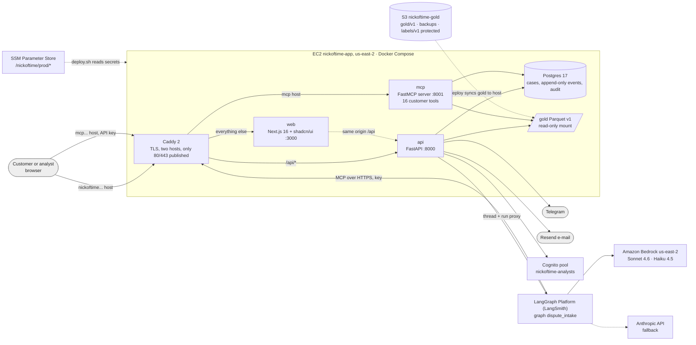
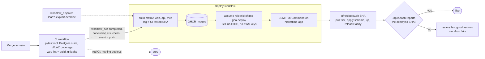
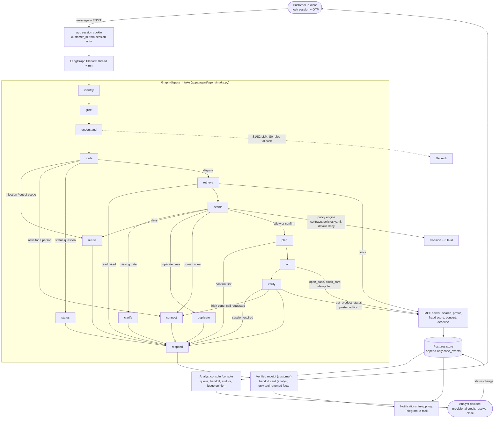
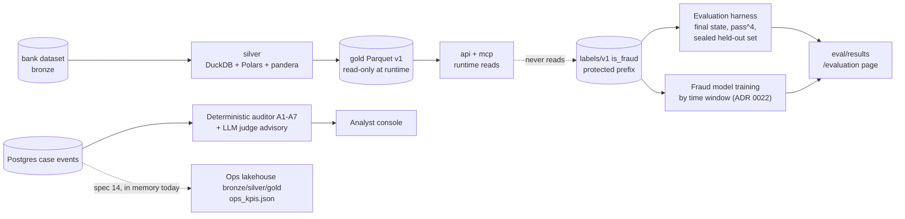

# Architecture (DRAFT for the lead's review)

Status: **draft**, written 2026-10-05 against `origin/main` at `4ca799a`. Nothing here replaces a current document; the
lead decides what moves to `docs/`. Every claim names the file it comes from. Where a figure appears it carries a label
from CLAUDE.md rule 8 (`[data]` `[external]` `[assumption]` `[simulated]` `[projected]`). Legend used in every diagram:
**solid = current** (in `main`), **dashed = future (P2) or not yet verified on the public URL**.

## 1. Services and where they run

Sources: `infra/compose.yml`, `infra/caddy/Caddyfile`, `.github/workflows/deploy.yml`, `docs/infrastructure.md`,
`langgraph.json`, `apps/api/README.md`, ADRs 0008, 0009, 0010, 0011, 0017.

Notes, each from its source:
- Only Caddy publishes ports; `web`, `api`, `mcp` and `postgres` are internal (`infra/compose.yml`, header comment).
- Caddy serves `nickoftime.salazarvalverdeai.com` (`/api/*` to `api:8000`, rest to `web:3000`, same origin so no CORS)
  and `mcp.nickoftime.salazarvalverdeai.com` (to `mcp:8001`) (`infra/caddy/Caddyfile`).
- `api` and `mcp` mount gold read-only at `/gold/v1` and share the Postgres `DATABASE_URL` (`infra/compose.yml`,
  spec 06 FR-09).
- The graph is `dispute_intake` in `apps/agent/agent/intake.py`, registered for Platform in `langgraph.json`; the api
  proxies threads and runs and keeps the Platform key server-side (`apps/api/README.md`, `apps/api/app/platform.py`).
  Platform reaches the MCP server at its public host, with an API key (ADR 0008; `docs/infrastructure.md`).
- Models: Bedrock `us-east-2`, `us.anthropic.claude-sonnet-4-6` for the graph and `...haiku-4-5...` for the fast path,
  as reported by `GET /api/health` on the public URL on 2026-10-05; Anthropic API is the fallback (ADR 0009).
- Analysts sign in with Cognito (admin-created users only); customers use a mock session and OTP (ADR 0017,
  `docs/infrastructure.md`).
- Gold lives in S3 `gold/v1/`; labels (`is_fraud`) sit apart in `labels/v1/` behind a deny-by-default policy and are not
  readable by the EC2 role, Platform or the deploy role (`docs/infrastructure.md`, CLAUDE.md rule 7).
- Verification state: `GET /api/health` on the public URL answered `git_sha` `4ca799a...`, contract `1.4.0`, policies
  version 2, `platform_revision: null` (2026-10-05). The Platform link is drawn solid because the api code and graph are
  in `main`; the null revision means the lead should confirm the deployed revision before this goes in a final doc.

## 2. Deploy path

Sources: `.github/workflows/deploy.yml` (header and jobs), `.github/workflows/ci.yml`, `infra/deploy.sh`,
`docs/infrastructure.md`, ADR 0011, PR #136.

- Deploy starts only from a completed CI run of a push to `main` with conclusion `success` (`deploy.yml`, `if:` on the
  build job; PR #136). `workflow_dispatch` is the lead's explicit override.
- One concurrency group, never cancelled half-way (`deploy.yml`, `concurrency`).
- `schema.sql` is idempotent and applied on every deploy (PR #129); gold is synced to the host (PR #119).

## 3. Business flow of a dispute

Sources: `apps/agent/agent/intake.py` (graph wiring, lines 778-800), specs 01, 02, 03, 04, 05, 08, 13, `CLAUDE.md`
(constitution and business rules), `contracts/policies.yaml` via spec 02.

Principle (CLAUDE.md rule 1): the LLM understands, the rules decide, the tools act, verification confirms, a person
closes.

How each stage maps to the repo:

| Stage | What happens | Source |
|---|---|---|
| Session | Customer picks a demo customer and verifies a mock OTP; `customer_id` comes only from the session | ADR 0017; `apps/api/app/main.py` (`/api/sessions`, `/verify`); CLAUDE.md rule 3 |
| greet / understand / route | Greeting with capabilities; intent and injection detection (S0 rules, S1/S2 LLM with budget and rules fallback); branch | spec 04; PRs #88, #133 |
| retrieve | Read-only tools find the customer's own transactions, profile, fraud score (optional input), currency conversion | spec 03; PRs #106, #120 |
| decide | The policy engine returns a decision and rule id by zone, country, mode and tier; the LLM never reads `policies.yaml` | spec 02; ADR 0005; PR #63 |
| plan / act | State the plan, then `open_case` and `block_card` with idempotency keys. High zone blocks unless the customer asked for a person (the analyst decides after the call, D-029) | specs 02 and 03; ADR 0024; PRs #80, #123 |
| verify | Re-read the product status; an action is reported only after its post-condition holds (`accepted` is not `verified`) | CLAUDE.md rule 4; spec 04; PR #109 |
| respond | Reply, receipt, handoff card, grounding check (exact match to tool results), 2-3 suggestion chips | CLAUDE.md rule 5; ADR 0016; PR #109 |
| Regulatory clock | `compute_deadline` returns the country's legal deadline with `source_url` from the data table in `policies.yaml`; unknown country returns `POL-CLOCK-UNKNOWN` | spec 02 section 4.3; ADR 0019; PRs #67, #120 |
| Case queue | `new -> verification or review -> resolved -> closed`, status is the last appended event | spec 02 (`transition`, `sla`); spec 05 AC-02; PR #86 |
| Analyst console | Inbox, handoff card, timeline, actions through `policy.transition`, auditor findings, judge second opinion (advisory) | specs 05, 08, 18; ADR 0021 |
| Person closes | No case is closed without a person; provisional credit is always a human decision | CLAUDE.md rule 6 |
| Notifications | Every status change reaches in-app log, Telegram and e-mail; never score, policy ids or transcript | spec 13; CLAUDE.md |

## 4. Data and evaluation plane

Sources: ADR 0004, 0007, 0018, 0022, `contracts/gold_contract.md`, specs 09, 10, 12, 14, 15, 17, 18, CLAUDE.md rule 7.

The dashed edge labeled "never reads" marks that the runtime does not read labels (CLAUDE.md rule 7).

## 5. Current vs future

| Area | Current (in `main`) | Future / not done | Source |
|---|---|---|---|
| Web | Next.js 16 shells for `/chat`, `/console`, `/login`, `/case/{id}`, `/evaluation`, `/analytics`, `/data`, `/agent`; mock data client, live wiring pending | Live wiring of chat and console (specs 07, 08 tasks 4-5, spec 16 task 5) | `apps/web/app/`; specs 07, 08, 16 section 10 |
| API | Store-backed FastAPI: sessions, case projections, analyst actions, Cognito check, channels, agent proxy (PR #111); demo customers from gold (PR #141) | Running on Postgres on the public URL (spec 05 task 7); rate limits and spend cap (open PR #148) | spec 05 section 10 |
| MCP | Gated server and the 16 tools through spec 03 T7 | Entry point, Dockerfile, compose service verified (spec 03 T8 unchecked) | spec 03 section 10 |
| Agent | All graph nodes in `intake.py`; S1/S2 understand with S0 fallback; INT1 end-to-end test against the real MCP server locally | INT3 on the public URL (gates `v0.4.0`); Platform deployment and `/agent` content (spec 04 T8) | spec 04 section 10; PRs #133, #138 |
| Policy | Rules engine, MX/AR/CO/BR clock rows, queue transitions, D-029 | PE and CL clock rows and holidays (spec 02 T3 unchecked) | spec 02 section 10; ADR 0023 |
| Data | Bronze to gold pipeline with contracts and manifest | none planned | ADR 0004 |
| Evaluation | Harness, held-out guard, 20 dev and 80 held-out cases, B0 rules arm | Held-out run on S0/S1/S2 and sealed protocol (spec 10 T6-T7, spec 09 M02) | specs 09, 10 section 10 |
| Voice channel | not built | **P2**: voice | task brief; no spec in `specs/` |
| Ops lakehouse | Bronze/silver/gold on the in-memory store (open PRs #145, #146) | **P2 parts**: Databricks Delta tables and notebooks (spec 14 T7), per-engine outcomes (T6) | spec 14 section 10 |
| MLOps | Fraud screen with calibration and cost harness (spec 17 T3); model benchmark arms and budget guard | **P2**: continuous retraining and model registry beyond the benchmark; `model_score` in the handoff (spec 17 T5, P1) | specs 15, 17; ADR 0018 |

## 6. Figures used here

| Figure | Value | Label | Source |
|---|---|---|---|
| FCR of dispute contacts, this problem | 43.6% vs 76.6% for the bank | `[data]` | CLAUDE.md "What it is"; `docs/problem_in_numbers.md` |
| Fraud-score zones | high >= 50, medium 30-49, human < 30 or null | `[assumption]` (policy parameters) | CLAUDE.md business rules; `contracts/policies.yaml` |
| Deadlines | MX debit credit by business day 2 for charges within 48 h; AR 10 business days; CO 15 business days | `[external]` | spec 02 section 4.3; ADRs 0019, 0023 (each row has `source_url` and `verified_on` in `policies.yaml`) |
| Replay date | 2026-06-01 | `[assumption]` (fixed demo date) | ADR 0012, ADR 0020 |
| Instance and budget | t3.medium, 100 USD/month budget | `[assumption]` (project configuration) | `docs/infrastructure.md` |
| Customers and transactions in demo | synthetic bank data | `[simulated]` | CLAUDE.md "What it is" |

Open points for the lead: confirm the Platform deployment revision (health shows `null`); decide whether the future
rows for voice and MLOps stay in the final diagram or only in the pitch.
