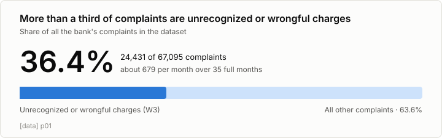
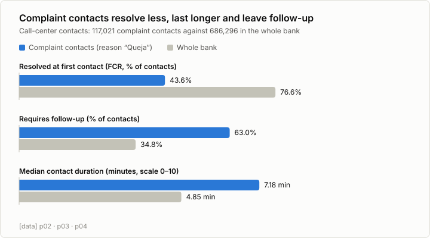
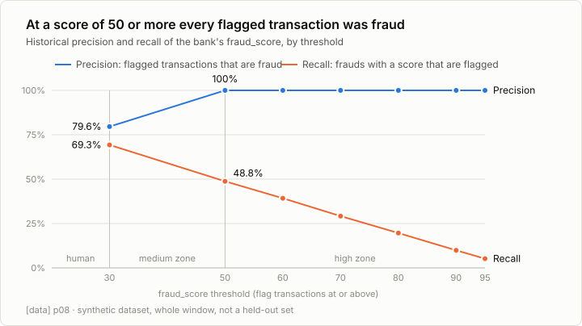
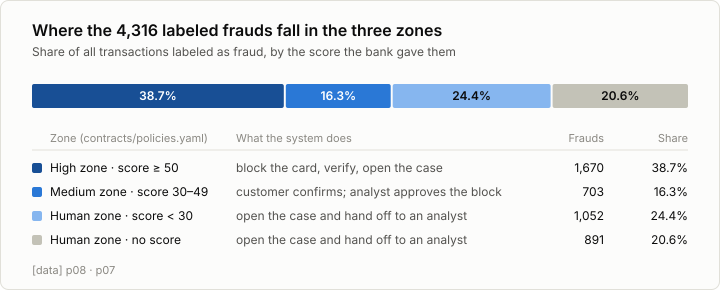

# The problem in numbers — why dispute intake, and why this design

What the data says about unrecognized and wrongful charges (workflow W3), and how each finding shaped the solution.
Every figure carries its label and its query; the charts are drawn from the CSVs in [`queries/pitch/`](../queries/pitch/)
by [`make_charts.py`](../queries/pitch/make_charts.py).

> **Read this first.** The dataset is synthetic. These numbers describe the problem; none of them measures our system.
> Results of the system come from the evaluation harness and are labeled `[simulated]`.

## 1. It is a large share of the bank's complaints

24,431 of 67,095 complaints (36.4%) are unrecognized or wrongful charges, about 679 per month over 35 full months
`[data]` ([query](../queries/pitch/p01_w3_share_complaints.sql)).

**Conclusion.** One workflow covers more than a third of the complaint volume, so improving its first contact moves a
number the bank already tracks.

## 2. These contacts go worse than the rest of the bank

| Measure | Complaint contacts | Whole bank | Query |
|---|---|---|---|
| Resolved at first contact (FCR) | 43.6% (CI95 43.3–43.9, n = 117,021) | 76.6% (n = 686,296) | [p02](../queries/pitch/p02_fcr_complaint_vs_bank.sql) |
| Requires follow-up | 63.0% | 34.8% | [p03](../queries/pitch/p03_complaint_follow_up.sql) |
| Median contact duration | 7.18 min | 4.85 min | [p04](../queries/pitch/p04_complaint_duration_vs_bank.sql) |

All `[data]`.

**Conclusion.** More than half of these contacts are not resolved the first time and almost two in three leave work
pending. The main goal of the system is therefore first-contact resolution (ADR 0014): identify the transaction, open
the case and tell the customer the legal deadline in the same conversation.

**Limits.**
- Contacts are matched to W3 by their reason (`Queja`), a low-confidence rule (INT-02 in
  [`workflow_mapping.md`](eda/workflow_mapping.md)). The 36.4% in section 1 comes from the complaints table instead.
- Satisfaction is also worse (NPS −85.3 against −74.5 `[data]`,
  [p05](../queries/pitch/p05_complaint_nps_vs_bank.sql)), but the survey scale in the dataset is 2–7 with no promoters,
  so it is only valid as a relative comparison.
- Resolution time is **not** a pain specific to W3: the median is 16 days, the same as the whole bank `[data]`
  ([p06](../queries/pitch/p06_w3_resolution_days.sql)). It matters only against the legal deadlines of section 5.

## 3. The bank's fraud score separates clear cases from unclear ones

| Threshold | Flagged | Of which fraud | Precision | Recall (frauds with a score) | Recall (all frauds) |
|---|---|---|---|---|---|
| score ≥ 30 | 2,982 | 2,373 | 79.6% | 69.3% | 55.0% |
| score ≥ 50 | 1,670 | 1,670 | 100% | 48.8% | 38.7% |

`[data]` ([query](../queries/pitch/p08_fraud_score_thresholds.sql)).

**Conclusion.** Above 50, acting at once is safe in this dataset: every flagged transaction was fraud. The band from
30 to 49 is different: it holds 1,312 flagged transactions of which 703 are fraud, a precision of 53.6% (derived from
the two rows above), so almost half are legitimate charges. There the system asks the customer first and a person
approves the block. These two cut-offs are the zones in [`contracts/policies.yaml`](../contracts/policies.yaml).

**Limits.** This is historical precision over the whole window, not a held-out set, and a precision of exactly 100% is
a property of the synthetic generator `[assumption]`. The thresholds live in configuration, not in code, so they can be
recalibrated on real data.

## 4. Almost half of the frauds cannot be decided by the score

Of the 4,316 transactions labeled as fraud (about 120 per month), 1,052 have a score below 30 and 891 have no score at
all: 45.0% together `[data]` ([p08](../queries/pitch/p08_fraud_score_thresholds.sql),
[p07](../queries/pitch/p07_fraud_per_month.sql)).

**Conclusion.** The handoff to a person is a main path, not an exception. That is why the system always opens a case,
in every zone, and gives the analyst a card with the verified facts instead of the raw conversation. A design that only
automated the high zone would leave six in ten frauds without a first-contact answer.

## 5. It is the only workflow with a legal clock

| Country | Obligation | Source |
|---|---|---|
| MX, debit card | Provisional credit by business day 2 | Banxico Circular 3/2012, art. 19 Bis 3 |
| MX, credit card | Ruling within 45 days (180 if the charge was abroad) | LTOSF art. 23 |
| AR | Resolve and reimburse within 10 business days | BCRA |
| CO | Answer within 15 days — not re-verified | SFC |
| BR | Ombudsman answer within 10 business days — not re-verified | Resolução CMN 4.860 (2020) |

`[external]`, as recorded with their links in [`contracts/policies.yaml`](../contracts/policies.yaml).

**Conclusion.** With a median resolution of 16 days, the first contact has to start the clock and state the deadline.
The system computes it per country and product and puts it on the customer's receipt and on the analyst's card.

## From finding to design

| Finding | Design decision |
|---|---|
| 36.4% of complaints; FCR 43.6% against 76.6% | Target first-contact resolution of dispute intake |
| 63.0% of contacts need follow-up | Open the case and give a verified receipt in the first contact |
| Precision 100% at score ≥ 50 | High zone: block, verify, open the case |
| Precision 53.6% inside the 30–49 band (79.6% at score ≥ 30) | Medium zone: the customer confirms, a person approves the block |
| 45.0% of frauds below 30 or without a score | Human zone: a case and a handoff card, always |
| Legal deadlines per country | Regulatory clock in the policy file, shown to customer and analyst |
| Synthetic data, score not validated on a held-out set | Rules in configuration, decisions by rules and not by the model, a person closes every case |

## What these numbers do not show
- Whether the system works: that is the evaluation, reported separately with its denominators.
- Real customer language: the dataset has no text, and none in Portuguese; the evaluation messages are written by the team.
- A savings figure: any business case built on these numbers is `[projected]` and must state its assumptions.
