# User guide

How to use Nick of Time, by audience. The screenshots come from the public URL, taken with Playwright on 2026-10-05
(production `a2fa15e`). The interface follows the language selector in the header (ES · PT · EN). These screenshots
use Spanish, the customer's language in the demo.

**Public URL:** https://nickoftime.salazarvalverdeai.com · **Demo date:** the dataset ends on 31 May 2026, so dataset
scenarios run on the frozen demo date of **1 June 2026**. A test charge runs on today's date
([ADR 0020](adr/0020-two-time-modes-historical-and-live.md)).

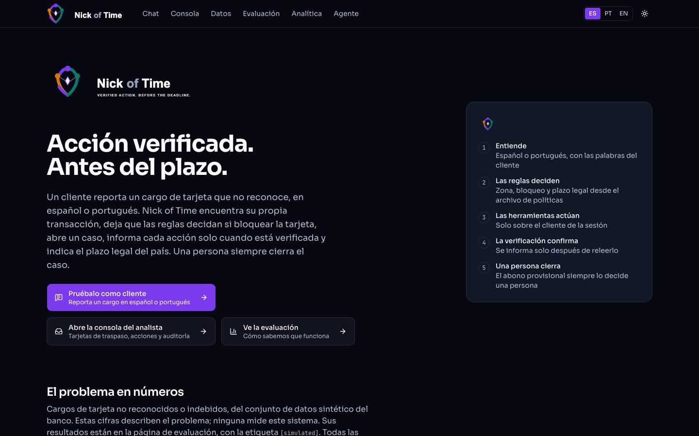

---

## 1. For judges: a 5-minute tour
| Minute | Do | What it proves |
|---|---|---|
| 0–1 | `/`: read the problem in numbers and "How it works" | The LLM understands, the rules decide, verification confirms, a person closes |
| 1–2 | `/chat`: pick a scenario and enter the code on screen, then *"No reconozco un cargo en mi tarjeta"* → **Sí, es ese cargo** | The plan before acting, each step live, a verified case and a receipt with the legal deadline and its source |
| 2–3 | `/chat` again, with **"A test charge I register"**: register 850 MXN and report it | A **verified card block** in the high zone |
| 3–4 | `/login` with the jury account from the submission e-mail → `/console` → open the case | The handoff card with evidence, the agent's summary, the customer's history, the rule audit and the AI second opinion (advisory); a person decides |
| 4–5 | `/evaluation`, `/analytics`, `/data`, `/agent` | Sealed results with their labels, the problem in numbers, the pipeline, the architecture |

Where the evidence for each criterion lives:
| Criterion | Evidence |
|---|---|
| Technical judgment | [decisions graph](decisions/graph.md) · [ADRs](adr/README.md) · [infrastructure](infrastructure.md) · `/agent` |
| AI engineering | the public URL · [contract](../specs/01-integration-contract.md) · CI on every PR · [testing](testing.md) |
| Data engineering | `/data` · [`data/pipeline/`](../data/pipeline/) · [quality report](../data/quality_report.md) |
| Machine learning | `/evaluation` · [`eval/PROTOCOL.md`](../eval/PROTOCOL.md) (sealed, `protocol-v1`) · [ADR 0027](adr/0027-model-selection.md) · [ADR 0031](adr/0031-heldout-scored-under-sealed-rules-and-d070.md) |
| Data analytics | `/analytics` · [`queries/`](../queries/) · every figure labeled `[data]`, `[external]`, `[simulated]` or `[projected]` |

## 2. For customers (`/chat`, `/case/{id}`)
1. **Start.** Choose the language (Español or Português), optionally your name, and a scenario, or "Assign me one".
   Under "What to dispute", pick a charge from the scenario or **a test charge you register**. Then tap "Send me a
   code" and enter the code shown on screen. In a real bank it arrives by SMS; you never type a customer id.

   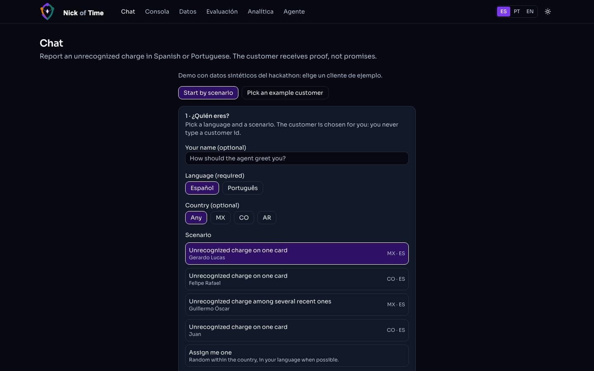
2. **Describe the charge** in your own words, by voice (hold the microphone), or with a chip.
   - If you don't name it, the assistant shows your recent charges as cards to pick from.
   - Nothing changes until you confirm. "Cómo lo decidí" opens the steps the assistant took.

   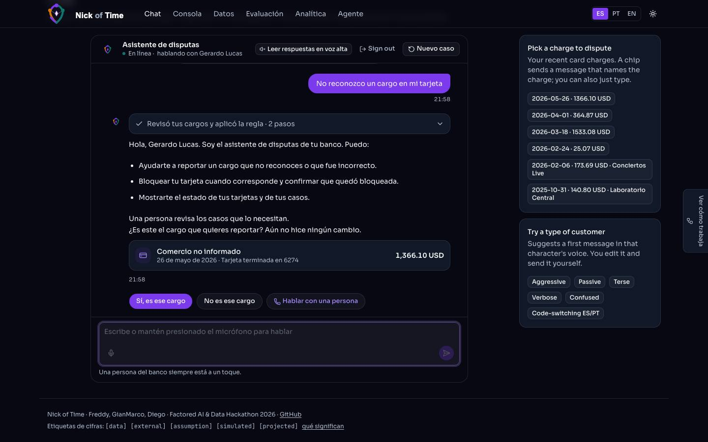
3. **Watch it work.** "Ver cómo trabaja" opens the live agent graph, which highlights the step the agent is on.

   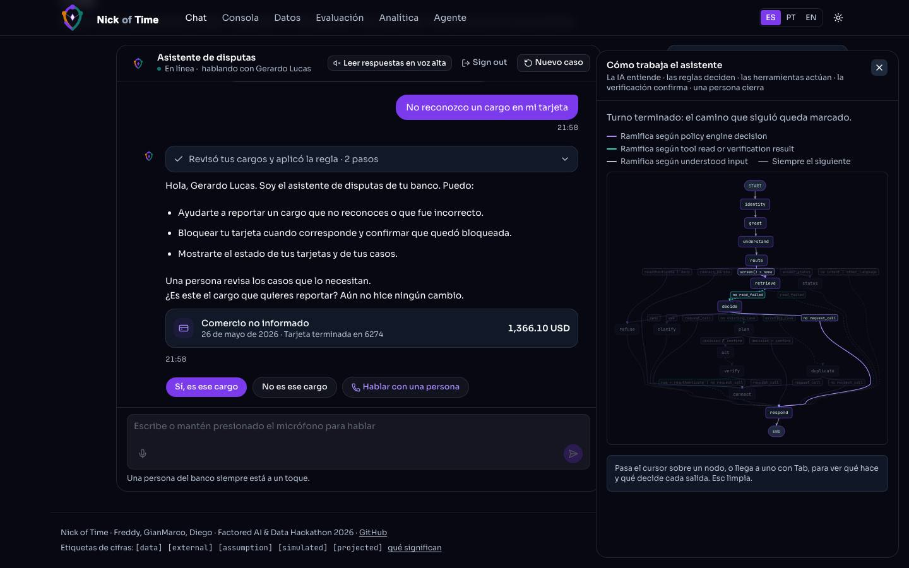
4. **Receipt.** The assistant states its plan and then reports only what it verified: the case opened, the card blocked
   when the rules call for it, the legal deadline with a countdown and its official source, and what a person does
   next. "Copiar" copies the receipt; "Ver mi caso" opens your case.

   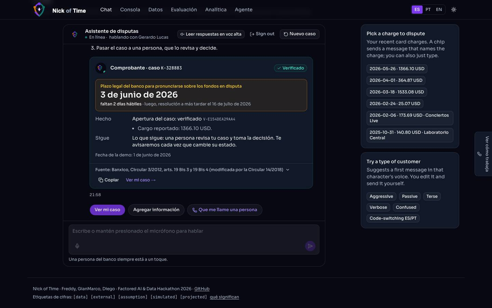

   With a test charge in the high zone, the receipt shows the **card block, verified**:

   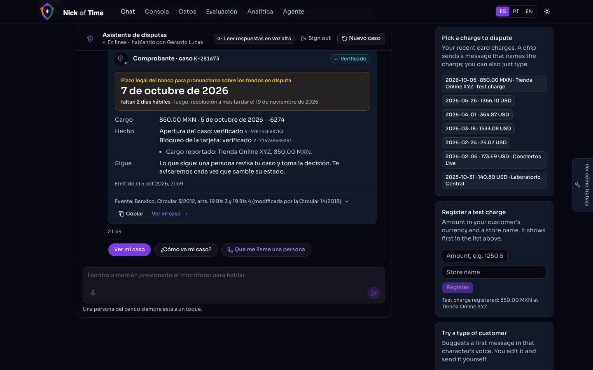
5. **Follow your case** at `/case/{id}`.
   - The page shows the status, the countdown to the legal deadline, the timeline and your notifications.
   - "Solicitar una llamada" asks for a call, and "Agregar información" sends details to the analyst.
   - Under **"Recibir actualizaciones"**, link your Telegram (our bot) or confirm your e-mail. Each status change of
     your case reaches you there. In the demo, your channels only receive your own case (ADR 0026, amended).

   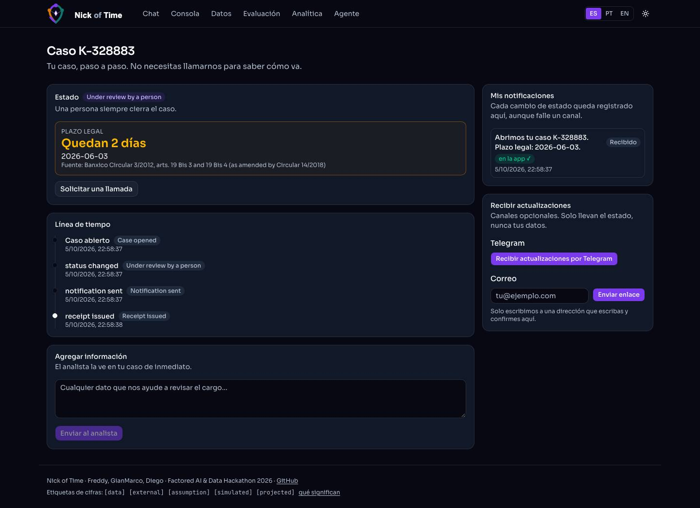
6. **A person is always reachable.** Every reply offers "Hablar con una persona". If you sound urgent or upset, the
   assistant says so and answers step by step.

What the assistant never does:
- show another customer's data;
- report an action it could not verify;
- promise money the rules did not grant;
- ask for your card number, CVV or password.

## 3. For dispute analysts (`/login`, `/console`)
1. **Sign in** with your analyst account (Amazon Cognito). The jury account is in the submission e-mail.

   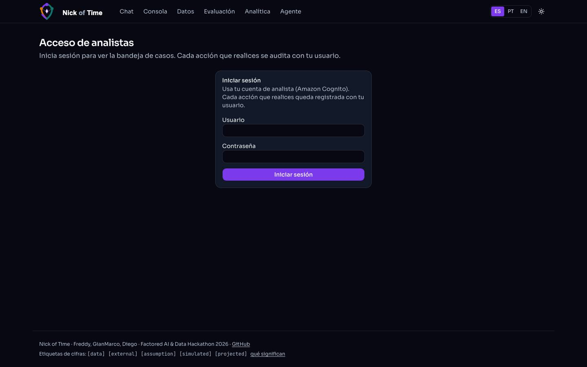
2. **Inbox.** At the top: open cases, deadlines at risk and time to verification. Cases are grouped by status, with zone,
   legal deadline and an SLA light. "Cerrados" holds the resolved and closed ones.

   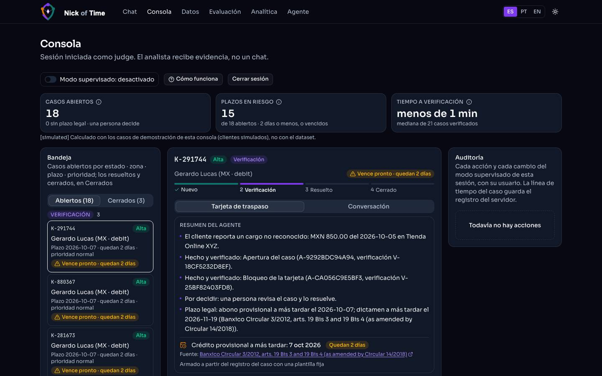
3. **Open a case.** You see:
   - the status stepper;
   - the **agent's summary**: what was reported, what was done and verified, what is left to decide, and the deadline;
   - the **handoff card** (verified facts, actions, evidence ids, the copilot's proposal in plain words) and the
     **Conversation** tab;
   - the **customer's history**: transactions within ±30 days with the disputed one marked, cards, calls and
     notifications;
   - the **rule audit**: the outcome re-derived from the rules, with checks A1–A7;
   - the **AI second opinion** (advisory, every reason tied to evidence);
   - the agent's path for the case, and the timeline.

   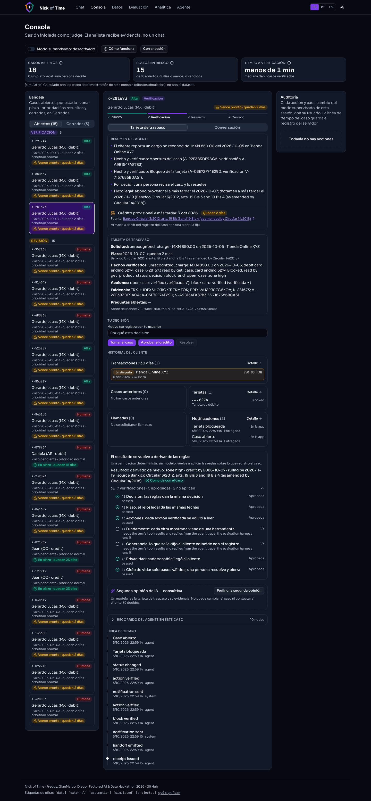
4. **Decide.** "Tomar el caso", "Aprobar el crédito", "Resolver", "Cerrar". Every action is audited with your user and
   your reason, and the customer is notified. Provisional credit is always a person's decision.
5. **Supervised mode.** When it is on, an approval needs a second confirmation.

## 4. Results and architecture
- `/evaluation` shows the sealed results. Every figure carries its label, and the held-out result is shown under both
  the sealed rules and D-070 (ADR 0031).

  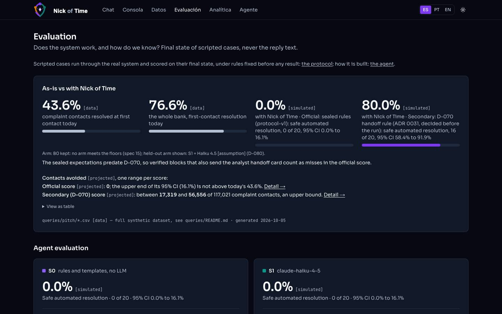
- `/agent` shows the architecture, the graph drawn from the code, the policies, the tools, the guardrails and the models.

  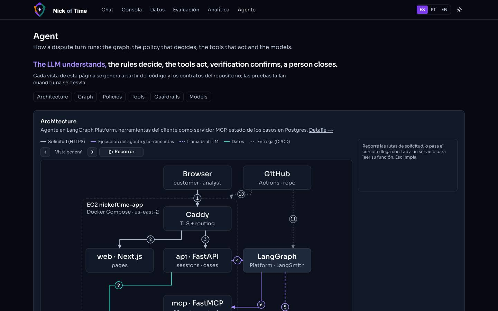

## 5. Troubleshooting
| Symptom | Meaning | What to do |
|---|---|---|
| "Tu sesión expiró" | Sessions last 15 minutes | Start again; nothing is lost |
| "Ahora no podemos escuchar tu audio" | The voice clip could not be transcribed | Type the message; the chat works the same |
| An action shows "no confirmado" | A tool did not confirm it; the agent escalated | A person completes it; check `/case/{id}` |
| "Sin segunda opinión" in the console | The judge did not answer or hit its budget | Decide as usual; nothing else changes |
| Too many requests (429) | Per-IP limits protect the demo | Wait a few minutes ([limits](infrastructure.md)) |

## Sources
ADR 0020 (two time modes), ADR 0026 (demo sessions and their channels), ADR 0029 (voice), ADR 0030 (writer and live
steps), ADR 0031 (two held-out scores), spec 07 (chat), spec 08 (console), spec 13 (case page and notifications),
spec 18 (auditor and second opinion).
